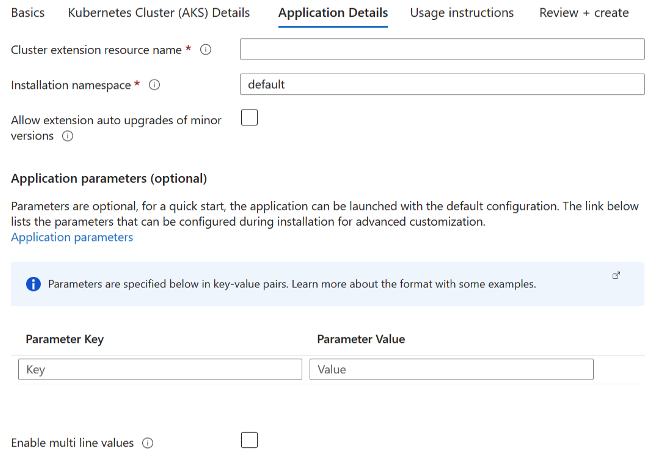

# Deploy Kafka on an Azure Kubernetes Service (AKS) Cluster using Bitnami Marketplace K8s application

This guide demonstrates how to deploy Kafka on an Azure Kubernetes Service (AKS) cluster using the Bitnami Kafka Helm chart and includes instructions for basic usage.

Apache Kafka is a distributed streaming platform designed to build real-time pipelines and can be used as a message broker or as a replacement for a log aggregation solution for big data applications.

## Prerequisites

Before you begin, ensure you have the following:

1. **Kubernetes cluster**: A running AKS Kubernetes cluster
2. **kubectl**: The Kubernetes command-line tool is installed and configured to interact with your cluster.
3. **PV provisioner** support in the underlying infrastructure

## Deployment and quick start

### Installing the Bitnami package for Kafka extension using Marketplace

- Navigate to Azure Portal: [https://portal.azure.com](https://portal.azure.com/)
- Navigate to the running Azure Kubernetes Service (AKS) cluster where you would like to install the extension. More details about AKS can be found in [What is Azure Kubernetes Service (AKS)? - Azure Kubernetes Service \| Microsoft Learn](https://learn.microsoft.com/en-us/azure/aks/what-is-aks).

1. For more information on how to create a Kubernetes (AKS) Cluster, navigate to [Kubernetes on Azure tutorial - Create an Azure Kubernetes Service (AKS) cluster - Azure Kubernetes Service \| Microsoft Learn](https://learn.microsoft.com/en-us/azure/aks/tutorial-kubernetes-deploy-cluster?tabs=azure-cli)

- Under the “Settings” tab, select “Extensions + Applications”.


- Select “Add” located at the top left portion of the “Extensions + Applications” page.
- In the “Search the Marketplace” bar, search for “Bitnami package for Kafka” and select the extension.
- Under Plan, select “Bitnami package for Kafka” and select “Create”

#### Under “Basics” Tab

##### Project Details

1. For “Subscriptions”, select the subscription your AKS cluster is under. All resources in an Azure subscription are billed together.
2. For “Resource Group”, select the resource group your AKS cluster is under. A resource group is a collection of resources that share the same lifecycle, permissions, and policies.

##### Instance Details

1. If you would like to create a new AKS Cluster, select “Yes”. If you would like to use an existing cluster, select “No”.  
2. If Creating a New Kubernetes Cluster: For “Region” select the region to be used with the newly created AKS cluster.

#### Under “Kubernetes Cluster (AKS) Details” Tab

If Using an Existing Kubernetes Cluster

1. Kubernetes Cluster (AKS) Name: The resource name of the existing managed Kubernetes cluster (AKS) in which the extension will be installed.


If Creating a New Kubernetes Cluster

1. Kubernetes Cluster (AKS) Name: The name of a new managed Kubernetes cluster (AKS) in which the extension will be installed. Use only allowed characters.
2. Kubernetes version: The version of Kubernetes that should be used for this managed Kubernetes cluster. You will be able to upgrade this version after creating the cluster.
3. VM size: The size of virtual machine for the managed Kubernetes cluster nodes.
4. Enable auto scaling: Whether to enable auto-scaler for the number of nodes in the managed Kubernetes cluster.
5. Number of agents: Number agent nodes in the managed Kubernetes cluster.


#### Under “Application Details” Tab

1. Cluster extension resource name: Create a name for your extension resource
2. The value must not be empty.
3. Only lowercase alphanumeric characters are allowed, and the value must be 6-30 characters long.
4. Installation namespace: The Kubernetes namespace in which the extension will be installed. If the namespace does not exist, it will be created.
5. Allow extension auto upgrades of minor versions: Whether to allow auto upgrades of minor versions for the extension.
6. Application parameters (optional): Parameters are optional, for a quick start, the application can be launched with the default configuration. The link below lists the parameters that can be configured during installation for advanced customization. [charts/bitnami/kafka at main · bitnami/charts](https://github.com/bitnami/charts/tree/main/bitnami/kafka)
7. Enable multi line values: Enable this option when some of the parameter values specified above need to be multi line strings. It will be activated or deactivated for new rows.



#### Under “Usage Instructions” Tab

1. The deployment notes of this solution provide useful information regarding how to access the application and the different parameters that have been generated during the deployment. Please take a look at the following guide to know more about it.

[Usage instructions for Azure Marketplace Kubernetes Applications](https://docs.bitnami.com/azure/faq/get-started/usage-instructions-cnab/)


#### Under “Review + Create”

1. Review the information and select “Create” at the bottom right portion of the page to install the Bitnami package for Kafka extension.

### Deploying Azure Resource Manager (ARM) Template with Azure CLI

Prerequisites

1. Kubernetes cluster: A running AKS Kubernetes cluster
2. Azure CLI: Azure command-line interface (Azure CLI) is a set of commands used to create and manage Azure resources. More information on Azure CLI can be found in [Azure Command-Line Interface (CLI) - Overview \| Microsoft Learn](https://learn.microsoft.com/en-us/cli/azure/).

Instructions

1. Create a resource group

```console
az group create  --name [insert resource group name] --location [insert location] 
```

1. Deploy the ARM Template

```console
az deployment group create --resource-group [insert resource group name] --template-file [path to ARM template file] 
```

### Installing the Bitnami package for Kafka extension using Azure CLI

Prerequisites

Before you begin, ensure you have the following:

1. Kubernetes cluster: A running AKS Kubernetes cluster
2. Azure CLI: Azure command-line interface (Azure CLI) is a set of commands used to create and manage Azure resources. More information on Azure CLI can be found in [Azure Command-Line Interface (CLI) - Overview \| Microsoft Learn](https://learn.microsoft.com/en-us/cli/azure/).

To install the AKS extension, input the following command into the command line:

```console
az k8s-extension create
  --name [insert extension name]
  --extension-type Bitnami.KafkaMain
  --scope namespace
  --cluster-name [insert existing AKS cluster name]
  --resource-group [insert resource group name]
  --cluster-type managedClusters
  --plan-name main
  --plan-product kafka-cnab
  --plan-publisher bitnami
  --target-namespace kafka

(optional) --configuration-settings [insert configuration settings]
```

Make sure to replace the placeholders (e.g., `[insert extension name]`, `[insert existing AKS cluster name]`, `[insert resource group name]`) with your specific details.

Example: `az k8s-extension create --name kafka --extension-type Bitnami.KafkaMain --scope namespace --cluster-name myAKScluster --resource-group myResourceGroup --cluster-type managedClusters --plan-name main --plan-product kafka-cnab --plan-publisher bitnami --target-namespace kafka --configuration-settings replicaCount=2 memoryHighWatermark.enabled="true" memoryHighWatermark.type="absolute" memoryHighWatermark.value="512Mi"`

### Terraform deployment

Prerequisites

1. **Terraform:** Feel free to refer to this guide for setup instructions: [Guide to Setting Up and Using Terraform and Azure CLI to Deploy a Kubernetes Cluster - Copy.docx](https://microsoft-my.sharepoint.com/:w:/r/personal/maanasagovi_microsoft_com/_layouts/15/Doc.aspx?sourcedoc=%7BE42D47A2-B605-47C8-AC8C-F612D3C11D7B%7D&file=Guide%20to%20Setting%20Up%20and%20Using%20Terraform%20and%20Azure%20CLI%20to%20Deploy%20a%20Kubernetes%20Cluster%20-%20Copy.docx&action=default&mobileredirect=true&share=IQGiRy3kBbbIR6yM9hLTwR17Ac4Au-OiH2pQPpFOnuOBMnA) **(or** [Install \| Terraform \| HashiCorp Developer](https://developer.hashicorp.com/terraform/install)**)**
2. **Azure CLI:** [How to install the Azure CLI \| Microsoft Learn](https://learn.microsoft.com/en-us/cli/azure/install-azure-cli)

#### Initialize Terraform

1. To initialize Terraform in the current directory where you have copied the k8s-extension-install sample run the following command:  

```console
terraform init  
```

1. Create a new directory for your Terraform configuration files and navigate to it.
2. Create a file named `main.tf` containing the following:

```text
provider "azurerm" {
  features {}
}

resource "azurerm_kubernetes_cluster" "aks" {
  name                = "[insert existing AKS cluster name]"
  location            = "[insert location]"
  resource_group_name = "[insert resource group name]"
  dns_prefix          = "aks"

  default_node_pool {
    name       = "default"
    node_count = 1
    vm_size    = "Standard_DS2_v2"
  }

  identity {
    type = "SystemAssigned"
  }
}

resource "azurerm_kubernetes_cluster_extension" "kafka" {
  name                 = "[insert extension name]"
  kubernetes_cluster_id = azurerm_kubernetes_cluster.aks.id
  extension_type       = "Bitnami.KafkaMain"
  scope {
    namespace = "kafka"
  }
  plan {
    name      = "main"
    product   = "kafka-cnab"
    publisher = "bitnami"
  }
  configuration_settings = {
    \# Add any configuration settings here
  }
}
```

1. Before you test run the main.tf file, you need to update the following in the tf file:  

**AKS cluster name** - The name of the AKS cluster.  
**Resource group name** - The name of the resource group where AKS cluster is located.  
**Extension name** - Name of the extension

## Deploy the application

1. Deploy the application with default configuration for azure-vote.  

```console
terraform apply 
```

### Access Kafka

1. By default, Kafka can be accessed by consumers via port 9092 on the following DNS name from within your cluster:

```text
kafka.default.svc.cluster.local
```

Each Kafka broker can be accessed by producers via port 9092 on the following DNS name(s) from within your cluster:

```text
kafka-controller-0.kafka-controller-headless.default.svc.cluster.local:9092
kafka-controller-1.kafka-controller-headless.default.svc.cluster.local:9092
kafka-controller-2.kafka-controller-headless.default.svc.cluster.local:9092 Kafka root password:
```

1. To connect a client to your Kafka, you need to create the 'client.properties' configuration files with the content below:

```text
security.protocol=SASL_PLAINTEXT
sasl.mechanism=SCRAM-SHA-256
sasl.jaas.config=org.apache.kafka.common.security.scram.ScramLoginModule required \
    username="user1" \
    password="$(kubectl get secret kafka-user-passwords --namespace default -o jsonpath='{.data.client-passwords}' | base64 -d | cut -d , -f 1)";
```

1. To create a pod that you can use as a Kafka client run the following commands:

```console
kubectl run kafka-client --restart='Never' --image docker.io/bitnami/kafka:3.9 --namespace default --command -- sleep infinity
kubectl cp --namespace default /path/to/client.properties kafka-client:/tmp/client.properties
kubectl exec --tty -i kafka-client --namespace default -- bash
```

1. Then you can produce and consume topics by running

```console
# PRODUCER:
kafka-console-producer.sh \
    --producer.config /tmp/client.properties \
    --bootstrap-server kafka.default.svc.cluster.local:9092 \
    --topic test

# CONSUMER:
kafka-console-consumer.sh \
    --consumer.config /tmp/client.properties \
    --bootstrap-server kafka.default.svc.cluster.local:9092 \
    --topic test \
    --from-beginning
```

> [!IMPORTANT]
> Depending on the deployment parameters, you may need to adjust the above commands, such as changing the namespace or deployment name.

## Configuration and installation details

### Resource requests and limits

Bitnami charts allow setting resource requests and limits for all containers inside the chart deployment. These are inside the `resources` value (check parameter table). Setting requests is essential for production workloads and these should be adapted to your specific use case.

To make this process easier, the chart contains the `resourcesPreset` values, which automatically sets the `resources` section according to different presets. Check these presets in [the bitnami/common chart](https://github.com/bitnami/charts/blob/main/bitnami/common/templates/_resources.tpl#L15). However, in production workloads using `resourcesPreset` is discouraged as it may not fully adapt to your specific needs. Find more information on container resource management in the [official Kubernetes documentation](https://kubernetes.io/docs/concepts/configuration/manage-resources-containers/).

### Set Pod affinity

This chart allows you to set your custom affinity using the `affinity` parameter. Find more information about Pod's affinity in the [kubernetes documentation](https://kubernetes.io/docs/concepts/configuration/assign-pod-node/#affinity-and-anti-affinity).

As an alternative, you can use of the preset configurations for pod affinity, pod anti-affinity, and node affinity available at the [bitnami/common](https://github.com/bitnami/charts/tree/main/bitnami/common#affinities) chart. To do so, set the `podAffinityPreset`, `podAntiAffinityPreset`, or `nodeAffinityPreset` parameters.

### Listeners configuration

This chart allows you to automatically configure Kafka with 3 listeners:

- One for inter-broker communications.
- A second one for communications with clients within the K8s cluster.
- (optional) a third listener for communications with clients outside the K8s cluster. Check [this section](#accessing-kafka-brokers-from-outside-the-cluster) for more information.

For more complex configurations, set the `listeners`, `advertisedListeners` and `listenerSecurityProtocolMap` parameters as needed.

### Enable security for Kafka and Zookeeper

You can configure different authentication protocols for each listener you configure in Kafka. For instance, you can use `sasl_tls` authentication for client communications, while using `tls` for inter-broker communications. This table shows the available protocols and the security they provide:

| Method    | Authentication               | Encryption via TLS |
|-----------|------------------------------|--------------------|
| plaintext | None                         | No                 |
| tls       | None                         | Yes                |
| mtls      | Yes (two-way authentication) | Yes                |
| sasl      | Yes (via SASL)               | No                 |
| sasl_tls  | Yes (via SASL)               | Yes                |

Configure the authentication protocols for client and inter-broker communications by setting the *auth.clientProtocol* and *auth.interBrokerProtocol* parameters to the desired ones, respectively.

If you enabled SASL authentication on any listener, you can set the SASL credentials using the parameters below:

- `auth.sasl.jaas.clientUsers`/`auth.sasl.jaas.clientPasswords`: when enabling SASL authentication for communications with clients.
- `auth.sasl.jaas.interBrokerUser`/`auth.sasl.jaas.interBrokerPassword`:  when enabling SASL authentication for inter-broker communications.
- `auth.jaas.zookeeperUser`/`auth.jaas.zookeeperPassword`: In the case that the Zookeeper chart is deployed with SASL authentication enabled.

In order to configure TLS authentication/encryption, you **can** create a secret per Kafka broker you have in the cluster containing the Java Key Stores (JKS) files: the truststore (`kafka.truststore.jks`) and the keystore (`kafka.keystore.jks`). Then, you need pass the secret names with the `tls.existingSecret` parameter when deploying the chart.

> [!NOTE]
> If the JKS files are password protected (recommended), you will need to provide the password to get access to the keystores. To do so, use the `tls.password` parameter to provide your password.

For instance, to configure TLS authentication on a Kafka cluster with 2 Kafka brokers use the commands below to create the secrets:

```console
kubectl create secret generic kafka-jks-0 --from-file=kafka.truststore.jks=./kafka.truststore.jks --from-file=kafka.keystore.jks=./kafka-0.keystore.jks
kubectl create secret generic kafka-jks-1 --from-file=kafka.truststore.jks=./kafka.truststore.jks --from-file=kafka.keystore.jks=./kafka-1.keystore.jks
```

> [!NOTE]
> the command above assumes you already created the truststore and keystores files. This [script](https://raw.githubusercontent.com/confluentinc/confluent-platform-security-tools/master/kafka-generate-ssl.sh) can help you with the JKS files generation.

If, for some reason (like using Cert-Manager) you can not use the default JKS secret scheme, you can use the additional parameters:

- `tls.jksTruststoreSecret` to define additional secret, where the `kafka.truststore.jks` is being kept. The truststore password **must** be the same as in `tls.password`
- `tls.jksTruststore` to overwrite the default value of the truststore key (`kafka.truststore.jks`).

> [!NOTE]
> If you are using cert-manager, particularly when an ACME issuer is used, the `ca.crt` field is not put in the `Secret` that cert-manager creates. To handle this, the `tls.pemChainIncluded` property can be set to `true` and the initContainer created by this Chart will attempt to extract the intermediate certs from the `tls.crt` field of the secret (which is a PEM chain)

> [!NOTE]
> The truststore/keystore from above **must** be protected with the same password as in `tls.password`

You can deploy the chart with authentication using the following parameters:

```yaml
replicaCount: 2
listeners:
  client:
    client:
      protocol: SASL
    interbroker:
      protocol: TLS
tls:
  existingSecret: kafka-jks
  password: jksPassword
sasl:
  client:
    users:
      - brokerUser
    passwords:
      - brokerPassword
  zookeeper:
    user: zookeeperUser
    password: zookeeperPassword
zookeeper:
  auth:
    enabled: true
    serverUsers: zookeeperUser
    serverPasswords: zookeeperPassword
    clientUser: zookeeperUser
    clientPassword: zookeeperPassword

```

You can deploy the chart with AclAuthorizer using the following parameters:

```yaml
replicaCount: 2
listeners:
  client:
    protocol: SASL
  interbroker:
    protocol: SASL_TLS
tls:
  existingSecret: kafka-jks-0
  password: jksPassword
sasl:
  client:
    users:
      - brokerUser
    passwords:
      - brokerPassword
  zookeeper:
    user: zookeeperUser
    password: zookeeperPassword
zookeeper:
  auth:
    enabled: true
    serverUsers: zookeeperUser
    serverPasswords: zookeeperPassword
    clientUser: zookeeperUser
    clientPassword: zookeeperPassword
authorizerClassName: kafka.security.authorizer.AclAuthorizer
allowEveryoneIfNoAclFound: false
superUsers: "User:admin"
```

If you are using Kafka ACLs, you might encounter in kafka-authorizer.log the following event: `[...] Principal = User:ANONYMOUS is Allowed Operation [...]`.

By setting the following parameter: `listeners.client.protocol=SSL` and `listener.client.sslClientAuth=required`, Kafka will require the clients to authenticate to Kafka brokers via certificate.

As result, we will be able to see in kafka-authorizer.log the events specific Subject: `[...] Principal = User:CN=kafka,OU=...,O=...,L=...,C=..,ST=... is [...]`.

### Accessing Kafka brokers from outside the cluster

In order to access Kafka Brokers from outside the cluster, an additional listener and advertised listener must be configured. Additionally, a specific service per kafka pod will be created.

There are three ways of configuring external access. Using LoadBalancer services, using NodePort services or using ClusterIP services.

#### Using LoadBalancer services

You have two alternatives to use LoadBalancer services:

- Option A) Use random load balancer IPs using an **initContainer** that waits for the IPs to be ready and discover them automatically.

```yaml
  externalAccess:
    enabled: true
    controller:
      service:
        type: LoadBalancer
        containerPorts:
          external: 9094
    broker:
      service:
        type: LoadBalancer
        ports:
          external: 9094
    autoDiscovery:
      enabled: true
  serviceAccount:
    create: true
  rbac:
    create: true
```

> [!NOTE]
> This option requires creating RBAC rules on clusters where RBAC policies are enabled.

- Option B) Manually specify the load balancer IPs:

```yaml
  externalAccess:
    enabled: true
    controller:
      service:
        type: LoadBalancer
        containerPorts:
          external: 9094
        loadBalancerIPs: 
          - 'external-ip-1'
          - 'external-ip-2'
    broker:
      service:
        type: LoadBalancer
        containerPorts:
          external: 9094
        loadBalancerIPs: 
          - 'external-ip-3'
          - 'external-ip-4'

```

> [!NOTE]
> You need to know in advance the load balancer IPs so each Kafka broker advertised listener is configured with it.

Following the aforementioned steps will also allow to connect the brokers from the outside using the cluster's default service (when `service.type` is `LoadBalancer` or `NodePort`). Use the property `service.externalPort` to specify the port used for external connections.

#### Using NodePort services

You have two alternatives to use NodePort services:

- Option A) Use random node ports using an **initContainer** that discover them automatically.

  ```yaml
  externalAccess:
    enabled: true
    controller:
      service:
        type: NodePort
    broker:
      service:
        type: NodePort
    autoDiscovery:
      enabled: true
  serviceAccount:
    create: true
  rbac:
    create: true
  ```

  > [!NOTE]
  > This option requires creating RBAC rules on clusters where RBAC policies are enabled.

- Option B) Manually specify the node ports:

  ```yaml
  externalAccess:
    enabled: true
    controller:
      service:
        type: NodePort
        nodePorts: 
          - 'node-port-1'
          - 'node-port-2'
  ```

  > [!NOTE]
  > You need to know in advance the node ports that will be exposed so each Kafka broker advertised listener is configured with it.

  The pod will try to get the external ip of the node using `curl -s https://ipinfo.io/ip` unless `externalAccess.<controller|broker>.service.domain` or `externalAccess.<controller|broker>.service.useHostIPs` is provided.

- Option C) Manually specify distinct external IPs (using controller+broker nodes)

  ```yaml
  externalAccess:
    enabled: true
    controller:
      service:
        type: NodePort
      externalIPs: 
        - '172.16.0.20'
        - '172.16.0.21'
        - '172.16.0.22'
  ```

  > [!NOTE]
  > You need to know in advance the available IP of your cluster that will be exposed so each Kafka broker advertised listener is configured with it.

#### Using ClusterIP services

> [!NOTE]
> This option requires that an ingress is deployed within your cluster

```yaml
externalAccess:
  enabled: true
  controller:
    service:
      type: ClusterIP
      ports:
        external: 9094
      domain: 'ingress-ip'
broker:
  service:
    type: ClusterIP
    ports:
      external: 9094
      domain: 'ingress-ip'
```

> [!NOTE]
> The deployed ingress must contain the following block:

```yaml
tcp:
  9094: "{{ include "common.names.namespace" . }}/{{ include "common.names.fullname" . }}-0-external:9094"
  9095: "{{ include "common.names.namespace" . }}/{{ include "common.names.fullname" . }}-1-external:9094"
  9096: "{{ include "common.names.namespace" . }}/{{ include "common.names.fullname" . }}-2-external:9094"
```

#### Name resolution with External-DNS

You can use the following values to generate External-DNS annotations which automatically creates DNS records for each ReplicaSet pod:

```yaml
externalAccess:
  controller:
    service:
      annotations:
        external-dns.alpha.kubernetes.io/hostname: "{{ .targetPod }}.example.com"
```

### Enable metrics

The chart can optionally start two metrics exporters:

- JMX exporter, to expose JMX metrics. By default, it uses port 5556.
- Zookeeper exporter, to expose Zookeeper metrics. By default, it uses port 9141.

To expose JMX metrics to Prometheus, use the parameter below:

```yaml
metrics:
  jmx:
    enabled: true
```

- To enable Zookeeper chart metrics, use the parameter below:

```yaml
zookeeper:
  metrics:
    enabled: true
```

### Prometheus metrics

This chart can be integrated with Prometheus by setting `metrics.jmx.enabled` to `true`. This will deploy a sidecar container with [jmx_exporter](https://github.com/prometheus/jmx_exporter) in all pods and a `metrics` service, which can be configured under the `metrics.service` section. This `metrics` service will have the necessary annotations to be automatically scraped by Prometheus.

#### Prometheus requirements

It is necessary to have a working installation of Prometheus or Prometheus Operator for the integration to work. Install the [Bitnami Prometheus helm chart](https://github.com/bitnami/charts/tree/main/bitnami/prometheus) or the [Bitnami Kube Prometheus helm chart](https://github.com/bitnami/charts/tree/main/bitnami/kube-prometheus) to easily have a working Prometheus in your cluster.

#### Integration with Prometheus Operator

The chart can deploy `ServiceMonitor` objects for integration with Prometheus Operator installations. To do so, set the value `metrics.serviceMonitor.enabled=true`. Ensure that the Prometheus Operator `CustomResourceDefinitions` are installed in the cluster or it will fail with the following error:

```text
no matches for kind "ServiceMonitor" in version "monitoring.coreos.com/v1"
```

Install the [Bitnami Kube Prometheus helm chart](https://github.com/bitnami/charts/tree/main/bitnami/kube-prometheus) for having the necessary CRDs and the Prometheus Operator.
