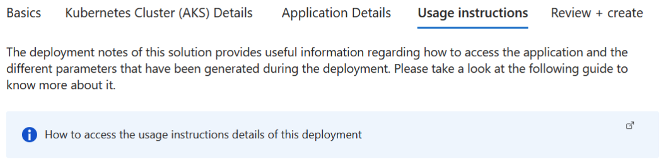

# Deploy MongoDB&reg; on an Azure Kubernetes Service (AKS) Cluster using Bitnami Marketplace K8s application

This guide demonstrates how to deploy MongoDB&reg; on an Azure Kubernetes Service (AKS) cluster using the Bitnami MongoDB&reg; Helm chart and includes instructions for basic usage.

MongoDB&reg; is a relational open source NoSQL database. Easy to use, it stores data in JSON-like documents. Automated scalability and high-performance. Ideal for developing cloud native applications.

## Prerequisites

Before you begin, ensure you have the following:

1. **Kubernetes cluster**: A running AKS Kubernetes cluster
2. **kubectl**: The Kubernetes command-line tool is installed and configured to interact with your cluster.
3. **PV provisioner** support in the underlying infrastructure

## Deployment and quick start

### Installing the Bitnami package for MongoDB&reg; extension using Marketplace

- Navigate to Azure Portal: [https://portal.azure.com](https://portal.azure.com/)
- Navigate to the running Azure Kubernetes Service (AKS) cluster where you would like to install the extension. More details about AKS can be found in [What is Azure Kubernetes Service (AKS)? - Azure Kubernetes Service \| Microsoft Learn](https://learn.microsoft.com/en-us/azure/aks/what-is-aks).

1. For more information on how to create a Kubernetes (AKS) Cluster, navigate to [Kubernetes on Azure tutorial - Create an Azure Kubernetes Service (AKS) cluster - Azure Kubernetes Service \| Microsoft Learn](https://learn.microsoft.com/en-us/azure/aks/tutorial-kubernetes-deploy-cluster?tabs=azure-cli)

- Under the “Settings” tab, select “Extensions + Applications”.


- Select “Add” located at the top left portion of the “Extensions + Applications” page.
- In the “Search the Marketplace” bar, search for “Bitnami package for MongoDB&reg;” and select the extension.
- Under Plan, select “Bitnami package for MongoDB&reg;” and select “Create”

#### Under “Basics” Tab

##### Project Details

1. For “Subscriptions”, select the subscription your AKS cluster is under. All resources in an Azure subscription are billed together.
2. For “Resource Group”, select the resource group your AKS cluster is under. A resource group is a collection of resources that share the same lifecycle, permissions, and policies.

##### Instance Details

1. If you would like to create a new AKS Cluster, select “Yes”. If you would like to use an existing cluster, select “No”.  
2. If Creating a New Kubernetes Cluster: For “Region” select the region to be used with the newly created AKS cluster.

#### Under “Kubernetes Cluster (AKS) Details” Tab

If Using an Existing Kubernetes Cluster

1. Kubernetes Cluster (AKS) Name: The resource name of the existing managed Kubernetes cluster (AKS) in which the extension will be installed.


If Creating a New Kubernetes Cluster

1. Kubernetes Cluster (AKS) Name: The name of a new managed Kubernetes cluster (AKS) in which the extension will be installed. Use only allowed characters.
2. Kubernetes version: The version of Kubernetes that should be used for this managed Kubernetes cluster. You will be able to upgrade this version after creating the cluster.
3. VM size: The size of virtual machine for the managed Kubernetes cluster nodes.
4. Enable auto scaling: Whether to enable auto-scaler for the number of nodes in the managed Kubernetes cluster.
5. Number of agents: Number agent nodes in the managed Kubernetes cluster.


#### Under “Application Details” Tab

1. Cluster extension resource name: Create a name for your extension resource
2. The value must not be empty.
3. Only lowercase alphanumeric characters are allowed, and the value must be 6-30 characters long.
4. Installation namespace: The Kubernetes namespace in which the extension will be installed. If the namespace does not exist, it will be created.
5. Allow extension auto upgrades of minor versions: Whether to allow auto upgrades of minor versions for the extension.
6. Application parameters (optional): Parameters are optional, for a quick start, the application can be launched with the default configuration. The link below lists the parameters that can be configured during installation for advanced customization. [charts/bitnami/mongodb at main · bitnami/charts](https://github.com/bitnami/charts/tree/main/bitnami/mongodb)
7. Enable multi line values: Enable this option when some of the parameter values specified above need to be multi line strings. It will be activated or deactivated for new rows.


#### Under “Usage Instructions” Tab

1. The deployment notes of this solution provide useful information regarding how to access the application and the different parameters that have been generated during the deployment. Please take a look at the following guide to know more about it.

[Usage instructions for Azure Marketplace Kubernetes Applications](https://docs.bitnami.com/azure/faq/get-started/usage-instructions-cnab/)



#### Under “Review + Create”

1. Review the information and select “Create” at the bottom right portion of the page to install the Bitnami package for MongoDB&reg; extension.

### Deploying Azure Resource Manager (ARM) Template with Azure CLI

Prerequisites

1. Kubernetes cluster: A running AKS Kubernetes cluster
2. Azure CLI: Azure command-line interface (Azure CLI) is a set of commands used to create and manage Azure resources. More information on Azure CLI can be found in [Azure Command-Line Interface (CLI) - Overview \| Microsoft Learn](https://learn.microsoft.com/en-us/cli/azure/).

Instructions

1. Create a resource group

```console
az group create  --name [insert resource group name] --location [insert location] 
```

1. Deploy the ARM Template

```console
az deployment group create --resource-group [insert resource group name] --template-file [path to ARM template file] 
```

### Installing the Bitnami package for MongoDB&reg; extension using Azure CLI

Prerequisites

Before you begin, ensure you have the following:

1. Kubernetes cluster: A running AKS Kubernetes cluster
2. Azure CLI: Azure command-line interface (Azure CLI) is a set of commands used to create and manage Azure resources. More information on Azure CLI can be found in [Azure Command-Line Interface (CLI) - Overview \| Microsoft Learn](https://learn.microsoft.com/en-us/cli/azure/).

To install the AKS extension, input the following command into the command line:

```console
az k8s-extension create
  --name [insert extension name]
  --extension-type Bitnami.MongoDBMain
  --scope namespace
  --cluster-name [insert existing AKS cluster name]
  --resource-group [insert resource group name]
  --cluster-type managedClusters
  --plan-name main
  --plan-product mongodb-cnab
  --plan-publisher bitnami
  --target-namespace mongodb

(optional) --configuration-settings [insert configuration settings] 
```

Make sure to replace the placeholders (e.g., `[insert extension name]`, `[insert existing AKS cluster name]`, `[insert resource group name]`) with your specific details.

Example: `az k8s-extension create --name mongodb --extension-type Bitnami.MongoDBMain --scope namespace --cluster-name myAKScluster --resource-group myResourceGroup --cluster-type managedClusters --plan-name main --plan-product mongodb-cnab --plan-publisher bitnami --target-namespace mongodb --configuration-settings replicaCount=2 memoryHighWatermark.enabled="true" memoryHighWatermark.type="absolute" memoryHighWatermark.value="512Mi"`

### Terraform deployment

Prerequisites

1. **Terraform:** Feel free to refer to this guide for setup instructions: [Guide to Setting Up and Using Terraform and Azure CLI to Deploy a Kubernetes Cluster - Copy.docx](https://microsoft-my.sharepoint.com/:w:/r/personal/maanasagovi_microsoft_com/_layouts/15/Doc.aspx?sourcedoc=%7BE42D47A2-B605-47C8-AC8C-F612D3C11D7B%7D&file=Guide%20to%20Setting%20Up%20and%20Using%20Terraform%20and%20Azure%20CLI%20to%20Deploy%20a%20Kubernetes%20Cluster%20-%20Copy.docx&action=default&mobileredirect=true&share=IQGiRy3kBbbIR6yM9hLTwR17Ac4Au-OiH2pQPpFOnuOBMnA) **(or** [Install \| Terraform \| HashiCorp Developer](https://developer.hashicorp.com/terraform/install)**)**
2. **Azure CLI:** [How to install the Azure CLI \| Microsoft Learn](https://learn.microsoft.com/en-us/cli/azure/install-azure-cli)

#### Initialize Terraform

1. To initialize Terraform in the current directory where you have copied the k8s-extension-install sample run the following command:  

```console
terraform init  
```

1. Create a new directory for your Terraform configuration files and navigate to it.
2. Create a file named `main.tf` containing the following:

```text
provider "azurerm" {
  features {}
}

resource "azurerm_kubernetes_cluster" "aks" {
  name                = "[insert existing AKS cluster name]"
  location            = "[insert location]"
  resource_group_name = "[insert resource group name]"
  dns_prefix          = "aks"

  default_node_pool {
    name       = "default"
    node_count = 1
    vm_size    = "Standard_DS2_v2"
  }

  identity {
    type = "SystemAssigned"
  }
}

resource "azurerm_kubernetes_cluster_extension" "mongodb" {
  name                 = "[insert extension name]"
  kubernetes_cluster_id = azurerm_kubernetes_cluster.aks.id
  extension_type       = "Bitnami.MongoDBMain"
  scope {
    namespace = "mongodb"
  }
  plan {
    name      = "main"
    product   = "mongodb-cnab"
    publisher = "bitnami"
  }
  configuration_settings = {
    \# Add any configuration settings here
  }
}
```

1. Before you test run the main.tf file, you need to update the following in the tf file:  

**AKS cluster name** - The name of the AKS cluster.  
**Resource group name** - The name of the resource group where AKS cluster is located.  
**Extension name** - Name of the extension

## Deploy the application

1. Deploy the application with default configuration for azure-vote.  

```console
terraform apply 
```

### Access MongoDB&reg;

1. Get MongoDB&reg; root password:

```console
export MONGODB_ROOT_PASSWORD=$(kubectl get secret --namespace default mongodb -o jsonpath="{.data.mongodb-root-password}" | base64 -d)
export MONGODB_ROOT_USER=$(echo "root")
```

1. To connect to your database you need to use a MongoDB&reg; client. You can deploy it by using a Bitnami container as follows:

```console
kubectl run --namespace default mongodb-client --rm --tty -i --restart='Never' --env="MONGODB_ROOT_PASSWORD=$MONGODB_ROOT_PASSWORD" --image docker.io/bitnami/mongodb:8.0 --command -- bash
```

1. Then, inside the container run the following command:

```console
mongosh admin --host "mongodb" --authenticationDatabase admin -u $MONGODB_ROOT_USER -p $MONGODB_ROOT_PASSWORD
```

> [!IMPORTANT]
> Depending on the deployment parameters, you may need to adjust the above commands, such as changing the namespace or deployment name.

## Configuration and installation details

### Resource requests and limits

Bitnami charts allow setting resource requests and limits for all containers inside the chart deployment. These are inside the `resources` value (check parameter table). Setting requests is essential for production workloads and these should be adapted to your specific use case.

To make this process easier, the chart contains the `resourcesPreset` values, which automatically sets the `resources` section according to different presets. Check these presets in [the bitnami/common chart](https://github.com/bitnami/charts/blob/main/bitnami/common/templates/_resources.tpl#L15). However, in production workloads using `resourcesPreset` is discouraged as it may not fully adapt to your specific needs. Find more information on container resource management in the [official Kubernetes documentation](https://kubernetes.io/docs/concepts/configuration/manage-resources-containers/).

### Set Pod affinity

This chart allows you to set your custom affinity using the `XXX.affinity` parameter(s). Find more information about Pod affinity in the [Kubernetes documentation](https://kubernetes.io/docs/concepts/configuration/assign-pod-node/#affinity-and-anti-affinity).

As an alternative, you can use the preset configurations for pod affinity, pod anti-affinity, and node affinity available at the [bitnami/common](https://github.com/bitnami/charts/tree/main/bitnami/common#affinities) chart. To do so, set the `XXX.podAffinityPreset`, `XXX.podAntiAffinityPreset`, or `XXX.nodeAffinityPreset` parameters.

### Customize a new MongoDB&reg; instance

The [Bitnami MongoDB&reg; image](https://github.com/bitnami/containers/tree/main/bitnami/mongodb) supports the use of custom scripts to initialize a fresh instance. In order to execute the scripts, two options are available:

- Specify them using the `initdbScripts` parameter as dict.
- Define an external Kubernetes ConfigMap with all the initialization scripts by setting the `initdbScriptsConfigMap` parameter. Note that this will override the previous option.

The allowed script extensions are `.sh` and `.js`.

### Replicaset: Access MongoDB&reg; nodes from outside the cluster

In order to access MongoDB&reg; nodes from outside the cluster when using a replicaset architecture, a specific service per MongoDB&reg; pod will be created. There are two ways of configuring external access:

- Using LoadBalancer services
- Using NodePort services.

#### Use LoadBalancer services

Three alternatives are available to use *LoadBalancer* services:

- Use random load balancer IP addresses using an *initContainer* that waits for the IP addresses to be ready and discovers them automatically. An example deployment configuration is shown below:

    ```yaml
    architecture: replicaset
    replicaCount: 2
    externalAccess:
      enabled: true
      service:
        type: LoadBalancer
      autoDiscovery:
        enabled: true
    serviceAccount:
      create: true
    automountServiceAccountToken: true
    rbac:
      create: true
    ```

    > [!NOTE]
    > This option requires creating RBAC rules on clusters where RBAC policies are enabled.

- Manually specify the load balancer IP addresses. An example deployment configuration is shown below, with the placeholder EXTERNAL-IP-ADDRESS-X used in place of the load balancer IP addresses:

    ```yaml
    architecture: replicaset
    replicaCount: 2
    externalAccess:
      enabled: true
      service:
        type: LoadBalancer
        loadBalancerIPs:
          - 'EXTERNAL-IP-ADDRESS-1'
          - 'EXTERNAL-IP-ADDRESS-2'
    ```

    > [!NOTE]
    > This option requires knowing the load balancer IP addresses, so that each MongoDB&reg; node's advertised hostname is configured with it.

- Specify `externalAccess.service.publicNames`. These names must be resolvable by the MongoDB&reg; containers. To ensure that, if this value is set, an initContainer is added to wait for the ip addresses associated to those names. We can combine this feature with `external-dns`, setting the required annotations to configure the load balancer names:

    ```yaml
    architecture: replicaset
    replicaCount: 2
    externalAccess:
      enabled: true
      service:
        type: LoadBalancer
        publicNames:
          - 'mongodb-0.example.com'
          - 'mongodb-1.example.com'
        annotationsList:
          - external-dns.alpha.kubernetes.io/hostname: mongodb-0.example.com
          - external-dns.alpha.kubernetes.io/hostname: mongodb-1.example.com
    ```

    > [!NOTE]
    > If register new DNS records for those names is not an option, the release can be upgraded setting `hostAliases` with the public IPs assigned to the external services.

#### Use NodePort services

Manually specify the node ports to use. An example deployment configuration is shown below, with the placeholder NODE-PORT-X used in place of the node ports:

```text
architecture=replicaset
replicaCount=2
externalAccess.enabled=true
externalAccess.service.type=NodePort
externalAccess.service.nodePorts[0]='NODE-PORT-1'
externalAccess.service.nodePorts[1]='NODE-PORT-2'
```

> [!NOTE]
> This option requires knowing the node ports that will be exposed, so each MongoDB&reg; node's advertised hostname is configured with it.

The pod will try to get the external IP address of the node using the command `curl -s https://ipinfo.io/IP-ADDRESS` unless the `externalAccess.service.domain` parameter is set.

### Bootstrapping with an External Cluster

This chart is equipped with the ability to bring online a set of Pods that connect to an existing MongoDB&reg; deployment that lies outside of Kubernetes. This effectively creates a hybrid MongoDB&reg; Deployment where both Pods in Kubernetes and Instances such as Virtual Machines can partake in a single MongoDB&reg; Deployment. This is helpful in situations where one may be migrating MongoDB&reg; from Virtual Machines into Kubernetes, for example. To take advantage of this, use the following as an example configuration:

```yaml
externalAccess:
  externalMaster:
    enabled: true
    host: external-mongodb-0.internal
```

> [!WARNING]
> To bootstrap MongoDB&reg; with an external master that lies outside of Kubernetes, be sure to set up external access using any of the suggested methods in this chart to have connectivity between the MongoDB&reg; members.

### Securing traffic using TLS

This chart supports enabling SSL/TLS between nodes in the cluster, as well as between MongoDB&reg; clients and nodes, by setting the `MONGODB_EXTRA_FLAGS` and `MONGODB_CLIENT_EXTRA_FLAGS` container environment variables, together with the correct `MONGODB_ADVERTISED_HOSTNAME`. To enable full TLS encryption, set the `tls.enabled` parameter to `true`.

#### Generate the self-signed certificates via pre-install Helm hooks

The `secrets-ca.yaml` file utilizes the Helm "pre-install" hook to ensure that the certificates will only be generated on chart install.

The `genCA()` function will create a new self-signed x509 certificate authority. The `genSignedCert()` function creates an object with the certificate and key, which are base64-encoded and used in a YAML-like object. The `genSignedCert()` function is passed the CN, an empty IP list (the nil part), the validity and the CA created previously.

A Kubernetes Secret is used to hold the signed certificate created above, and the `initContainer` sets up the rest. Using Helm's hook annotations ensures that the certificates will only be generated on chart install. This will prevent overriding the certificates if the chart is upgraded.

#### Use your own CA

To use your own CA, set `tls.caCert` and `tls.caKey` with appropriate base64 encoded data. The `secrets-ca.yaml` file will utilize this data to create the Secret.

> [!NOTE]
> Currently, only RSA private keys are supported.

#### Use your own certificates

To use your own certificates, set `tls.standalone.existingSecret`, `tls.replicaset.existingSecrets`, `tls.hidden.existingSecrets` and/or `tls.arbiter.existingSecret` secrets according to your needs. All of them must be references to `kubernetes.io/tls` secrets and the certificates must be created using the same CA. The CA can be added directly to each secret using the `ca.crt` key:

```console
kubectl create secret tls "mongodb-0-cert"  --cert="mongodb-0.crt" --key="mongodb-0.key"
kubectl patch secret "mongodb-0-cert" -p="{\"data\":{\"ca.crt\": \"$(cat ca.crt | base64 -w0 )\"}}"
```

Or adding it to the "endpoint certificate" and setting the value `tls.pemChainIncluded`. If we reuse the example above, the `mongodb-0.crt` file should include CA cert and we shouldn't need to patch the secret to add the `ca.crt` set key.

> [!NOTE]
> Certificates should be signed for the fully qualified domain names. If `externalAccess.service.publicNames`is set, those names should be used in the certificates set in `tls.replicaset.existingSecrets`.

#### Access the cluster

To access the cluster, enable the init container which generates the MongoDB&reg; server/client PEM key needed to access the cluster. Please be sure to include the `$my_hostname` section with your actual hostname, and the alternative hostnames section should contain the hostnames that should be allowed access to the MongoDB&reg; replicaset. Additionally, if external access is enabled, the load balancer IP addresses are added to the alternative names list.

> [!NOTE]
> You will be generating self-signed certificates for the MongoDB&reg; deployment. The init container generates a new MongoDB&reg; private key which will be used to create a Certificate Authority (CA) and the public certificate for the CA. The Certificate Signing Request will be created as well and signed using the private key of the CA previously created. Finally, the PEM bundle will be created using the private key and public certificate. This process will be repeated for each node in the cluster.

#### Start the cluster

After the certificates have been generated and made available to the containers at the correct mount points, the MongoDB&reg; server will be started with TLS enabled. The options for the TLS mode will be one of `disabled`, `allowTLS`, `preferTLS`, or `requireTLS`. This value can be changed via the `MONGODB_EXTRA_FLAGS` field using the `tlsMode` parameter. The client should now be able to connect to the TLS-enabled cluster with the provided certificates.

### Backup and restore

Two different approaches are available to back up and restore Bitnami MongoDB&reg; Helm chart deployments on Kubernetes:

- Back up the data from the source deployment and restore it in a new deployment using MongoDB&reg; built-in backup/restore tools.
- Back up the persistent volumes from the source deployment and attach them to a new deployment using Velero, a Kubernetes backup/restore tool.

#### Method 1: Backup and restore data using MongoDB&reg; built-in tools

This method involves the following steps:

- Use the *mongodump* tool to create a snapshot of the data in the source cluster.
- Create a new MongoDB&reg; Cluster deployment and forward the MongoDB&reg; Cluster service port for the new deployment.
- Restore the data using the *mongorestore* tool to import the backup to the new cluster.

> [!NOTE]
> Under this approach, it is important to create the new deployment on the destination cluster using the same credentials as the original deployment on the source cluster.

#### Method 2: Back up and restore persistent data volumes

This method involves copying the persistent data volumes for the MongoDB&reg; nodes and reusing them in a new deployment with [Velero](https://velero.io/), an open source Kubernetes backup/restore tool. This method is only suitable when:

- The Kubernetes provider is [supported by Velero](https://velero.io/docs/latest/supported-providers/).
- Both clusters are on the same Kubernetes provider, as this is a requirement of [Velero's native support for migrating persistent volumes](https://velero.io/docs/latest/migration-case/).
- The restored deployment on the destination cluster will have the same name, namespace, topology and credentials as the original deployment on the source cluster.

This method involves the following steps:

- Install Velero on the source and destination clusters.
- Use Velero to back up the PersistentVolumes (PVs) used by the deployment on the source cluster.
- Use Velero to restore the backed-up PVs on the destination cluster.
- Create a new deployment on the destination cluster with the same chart, deployment name, credentials and other parameters as the original. This new deployment will use the restored PVs and hence the original data.

Refer to our detailed [tutorial on backing up and restoring MongoDB&reg; chart deployments on Kubernetes](https://techdocs.broadcom.com/us/en/vmware-tanzu/application-catalog/tanzu-application-catalog/services/tac-doc/apps-tutorials-backup-restore-data-mongodb-kubernetes-index.html), which covers both these approaches, for more information.

### Update credentials

Bitnami charts, with its default settings, configure credentials at first boot. Any further change in the secrets or credentials can be done using one of the following methods:

#### Manual update of the passwords and secrets

- Update the user password following [the upstream documentation](https://www.mongodb.com/docs/manual/reference/method/db.changeUserPassword/)
- Update the password secret with the new values (replace the SECRET_NAME, PASSWORDS and ROOT_PASSWORD placeholders)

```console
kubectl create secret generic SECRET_NAME --from-literal=mongodb-passwords=PASSWORD --from-literal=mongodb-root-password=ROOT_PASSWORD --dry-run -o yaml | kubectl apply -f -
```

#### Automated update using a password update job

The Bitnami MongoDB&reg; provides a password update job that will automatically change the MongoDB&reg; passwords when running helm upgrade. To enable the job set `passwordUpdateJob.enabled=true`. This job requires:

- The new passwords: this is configured using either `auth.rootPassword`, `auth.passwords` and `metrics.passwords` (if applicable) or setting `auth.existingSecret`.
- The previous root password: This value is taken automatically from already deployed secret object. If you are using `auth.existingSecret` or `helm template` instead of `helm upgrade`, then set either `passwordUpdateJob.previousPasswords.rootPassword` or  setting `passwordUpdateJob.previousPasswords.existingSecret`.

In the following example we update only the root password via values.yaml in a MongoDB&reg; installation:

```yaml
auth:
  rootPassword: "newRootPassword123"
passwordUpdateJob:
  enabled: true
```

In the following example we update the password via values.yaml in a MongoDB&reg; installation with replication and several usernames and databases (including metrics).

```yaml
architecture: "replication"

auth:
  usernames:
    - "user1"
    - "user2"
  rootPassword: "newRootPassword123"
  passwords:
    - "newUserPassword123"
    - "newUserPassword144"
  databases:
    - "userdatabase"
    - "userdatabase2"

metrics:
  username: "metricsuser"
  password: "newMetricsPassword"

passwordUpdateJob:
  enabled: true
```

In this example we use two existing secrets (`new-password-secret` and `previous-password-secret`) to update several users and passwords (including metrics):

```yaml
auth:
  usernames:
    - "user1"
    - "user2"
  databases:
    - "userdatabase"
    - "userdatabase2"
  existingSecret: new-password-secret

metrics:
  username: "metricsuser"

passwordUpdateJob:
  enabled: true
  previousPasswords:
    existingSecret: previous-password-secret
```

You can add extra update commands using the `passwordUpdateJob.extraCommands` value.

### Add extra environment variables

To add extra environment variables (useful for advanced operations like custom init scripts), use the `extraEnvVars` property.

```yaml
extraEnvVars:
  - name: LOG_LEVEL
    value: error
```

Alternatively, you can use a ConfigMap or a Secret with the environment variables. To do so, use the `extraEnvVarsCM` or the `extraEnvVarsSecret` properties.

### Deploying extra resources

There are cases where you may want to deploy extra objects, such as a ConfigMap containing your app's configuration or some extra deployment with a microservice used by your app. To cover this case, the chart allows adding the full specification of other objects using the extraDeploy parameter.

### Prometheus metrics

This chart can be integrated with Prometheus by setting `metrics.enabled` to `true`. This will deploy a sidecar container with [mongodb_exporter](https://github.com/percona/mongodb_exporter) in all pods and a `metrics` service, which can be configured under the `metrics.service` section. This `metrics` service will have the necessary annotations to be automatically scraped by Prometheus.

#### Prometheus requirements

It is necessary to have a working installation of Prometheus or Prometheus Operator for the integration to work. Install the [Bitnami Prometheus helm chart](https://github.com/bitnami/charts/tree/main/bitnami/prometheus) or the [Bitnami Kube Prometheus helm chart](https://github.com/bitnami/charts/tree/main/bitnami/kube-prometheus) to easily have a working Prometheus in your cluster.

#### Use custom Prometheus rules

Custom Prometheus rules can be defined for the Prometheus Operator by using the `prometheusRule` parameter. A basic configuration example is shown below:

```yaml
    metrics:
      enabled: true
      prometheusRule:
        enabled: true
        rules:
        - name: rule1
          rules:
          - alert: HighRequestLatency
            expr: job:request_latency_seconds:mean5m{job="myjob"} > 0.5
            for: 10m
            labels:
              severity: page
            annotations:
              summary: High request latency
```

#### Integration with Prometheus Operator

The chart can deploy `ServiceMonitor` objects for integration with Prometheus Operator installations. To do so, set the value `metrics.serviceMonitor.enabled=true`. Ensure that the Prometheus Operator `CustomResourceDefinitions` are installed in the cluster or it will fail with the following error:

```text
no matches for kind "ServiceMonitor" in version "monitoring.coreos.com/v1"
```

Install the [Bitnami Kube Prometheus helm chart](https://github.com/bitnami/charts/tree/main/bitnami/kube-prometheus) for having the necessary CRDs and the Prometheus Operator.
