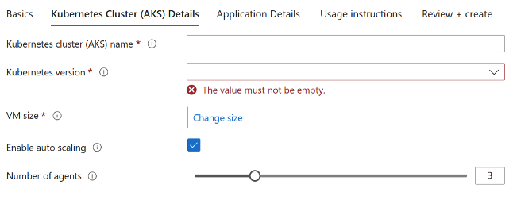
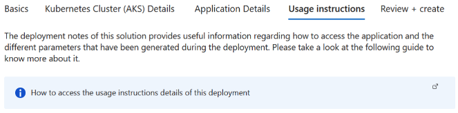

# Deploy NGINX on an Azure Kubernetes Service (AKS) Cluster using Bitnami Marketplace K8s application

This guide demonstrates how to deploy NGINX on an Azure Kubernetes Service (AKS) cluster using the Bitnami NGINX Helm chart and includes instructions for basic usage.

NGINX Open Source is a web server that can be also used as a reverse proxy, load balancer, and HTTP cache. Recommended for high-demanding sites due to its ability to provide faster content.

## Prerequisites

Before you begin, ensure you have the following:

1. **Kubernetes cluster**: A running AKS Kubernetes cluster
2. **kubectl**: The Kubernetes command-line tool is installed and configured to interact with your cluster.

## Deployment and quick start

### Installing the Bitnami package for NGINX extension using Marketplace

- Navigate to Azure Portal: [https://portal.azure.com](https://portal.azure.com/)
- Navigate to the running Azure Kubernetes Service (AKS) cluster where you would like to install the extension. More details about AKS can be found in [What is Azure Kubernetes Service (AKS)? - Azure Kubernetes Service \| Microsoft Learn](https://learn.microsoft.com/en-us/azure/aks/what-is-aks).

1. For more information on how to create a Kubernetes (AKS) Cluster, navigate to [Kubernetes on Azure tutorial - Create an Azure Kubernetes Service (AKS) cluster - Azure Kubernetes Service \| Microsoft Learn](https://learn.microsoft.com/en-us/azure/aks/tutorial-kubernetes-deploy-cluster?tabs=azure-cli)

- Under the “Settings” tab, select “Extensions + Applications”.


- Select “Add” located at the top left portion of the “Extensions + Applications” page.
- In the “Search the Marketplace” bar, search for “Bitnami package for NGINX” and select the extension.
- Under Plan, select “Bitnami package for NGINX” and select “Create”

#### Under “Basics” Tab

##### Project Details

1. For “Subscriptions”, select the subscription your AKS cluster is under. All resources in an Azure subscription are billed together.
2. For “Resource Group”, select the resource group your AKS cluster is under. A resource group is a collection of resources that share the same lifecycle, permissions, and policies.

##### Instance Details

1. If you would like to create a new AKS Cluster, select “Yes”. If you would like to use an existing cluster, select “No”.  
2. If Creating a New Kubernetes Cluster: For “Region” select the region to be used with the newly created AKS cluster.

#### Under “Kubernetes Cluster (AKS) Details” Tab

If Using an Existing Kubernetes Cluster

1. Kubernetes Cluster (AKS) Name: The resource name of the existing managed Kubernetes cluster (AKS) in which the extension will be installed.


If Creating a New Kubernetes Cluster

1. Kubernetes Cluster (AKS) Name: The name of a new managed Kubernetes cluster (AKS) in which the extension will be installed. Use only allowed characters.
2. Kubernetes version: The version of Kubernetes that should be used for this managed Kubernetes cluster. You will be able to upgrade this version after creating the cluster.
3. VM size: The size of virtual machine for the managed Kubernetes cluster nodes.
4. Enable auto scaling: Whether to enable auto-scaler for the number of nodes in the managed Kubernetes cluster.
5. Number of agents: Number agent nodes in the managed Kubernetes cluster.



#### Under “Application Details” Tab

1. Cluster extension resource name: Create a name for your extension resource
2. The value must not be empty.
3. Only lowercase alphanumeric characters are allowed, and the value must be 6-30 characters long.
4. Installation namespace: The Kubernetes namespace in which the extension will be installed. If the namespace does not exist, it will be created.
5. Allow extension auto upgrades of minor versions: Whether to allow auto upgrades of minor versions for the extension.
6. Application parameters (optional): Parameters are optional, for a quick start, the application can be launched with the default configuration. The link below lists the parameters that can be configured during installation for advanced customization. [charts/bitnami/nginx at main · bitnami/charts](https://github.com/bitnami/charts/tree/main/bitnami/nginx)
7. Enable multi line values: Enable this option when some of the parameter values specified above need to be multi line strings. It will be activated or deactivated for new rows.


#### Under “Usage Instructions” Tab

1. The deployment notes of this solution provide useful information regarding how to access the application and the different parameters that have been generated during the deployment. Please take a look at the following guide to know more about it.

[Usage instructions for Azure Marketplace Kubernetes Applications](https://docs.bitnami.com/azure/faq/get-started/usage-instructions-cnab/)



#### Under “Review + Create”

1. Review the information and select “Create” at the bottom right portion of the page to install the Bitnami package for NGINX extension.

### Deploying Azure Resource Manager (ARM) Template with Azure CLI

Prerequisites

1. Kubernetes cluster: A running AKS Kubernetes cluster
2. Azure CLI: Azure command-line interface (Azure CLI) is a set of commands used to create and manage Azure resources. More information on Azure CLI can be found in [Azure Command-Line Interface (CLI) - Overview \| Microsoft Learn](https://learn.microsoft.com/en-us/cli/azure/).

Instructions

1. Create a resource group

```console
az group create  --name [insert resource group name] --location [insert location] 
```

1. Deploy the ARM Template

```console
az deployment group create --resource-group [insert resource group name] --template-file [path to ARM template file] 
```

### Installing the Bitnami package for NGINX extension using Azure CLI

Prerequisites

Before you begin, ensure you have the following:

1. Kubernetes cluster: A running AKS Kubernetes cluster
2. Azure CLI: Azure command-line interface (Azure CLI) is a set of commands used to create and manage Azure resources. More information on Azure CLI can be found in [Azure Command-Line Interface (CLI) - Overview \| Microsoft Learn](https://learn.microsoft.com/en-us/cli/azure/).

To install the AKS extension, input the following command into the command line:

```console
az k8s-extension create
  --name [insert extension name]
  --extension-type Bitnami.NGINXMain
  --scope namespace
  --cluster-name [insert existing AKS cluster name]
  --resource-group [insert resource group name]
  --cluster-type managedClusters
  --plan-name main
  --plan-product nginx-cnab
  --plan-publisher bitnami
  --target-namespace nginx

(optional) --configuration-settings [insert configuration settings]
```

Make sure to replace the placeholders (e.g., `[insert extension name]`, `[insert existing AKS cluster name]`, `[insert resource group name]`) with your specific details.

Example: `az k8s-extension create --name nginx --extension-type Bitnami.NGINXMain --scope namespace --cluster-name myAKScluster --resource-group myResourceGroup --cluster-type managedClusters --plan-name main --plan-product nginx-cnab --plan-publisher bitnami --target-namespace nginx --configuration-settings replicaCount=2 memoryHighWatermark.enabled="true" memoryHighWatermark.type="absolute" memoryHighWatermark.value="512Mi"`

### Terraform deployment

Prerequisites

1. **Terraform:** Feel free to refer to this guide for setup instructions: [Guide to Setting Up and Using Terraform and Azure CLI to Deploy a Kubernetes Cluster - Copy.docx](https://microsoft-my.sharepoint.com/:w:/r/personal/maanasagovi_microsoft_com/_layouts/15/Doc.aspx?sourcedoc=%7BE42D47A2-B605-47C8-AC8C-F612D3C11D7B%7D&file=Guide%20to%20Setting%20Up%20and%20Using%20Terraform%20and%20Azure%20CLI%20to%20Deploy%20a%20Kubernetes%20Cluster%20-%20Copy.docx&action=default&mobileredirect=true&share=IQGiRy3kBbbIR6yM9hLTwR17Ac4Au-OiH2pQPpFOnuOBMnA) **(or** [Install \| Terraform \| HashiCorp Developer](https://developer.hashicorp.com/terraform/install)**)**
2. **Azure CLI:** [How to install the Azure CLI \| Microsoft Learn](https://learn.microsoft.com/en-us/cli/azure/install-azure-cli)

#### Initialize Terraform

1. To initialize Terraform in the current directory where you have copied the k8s-extension-install sample run the following command:  

```console
terraform init  
```

1. Create a new directory for your Terraform configuration files and navigate to it.
2. Create a file named `main.tf` containing the following:

```text
provider "azurerm" {
  features {}
}

resource "azurerm_kubernetes_cluster" "aks" {
  name                = "[insert existing AKS cluster name]"
  location            = "[insert location]"
  resource_group_name = "[insert resource group name]"
  dns_prefix          = "aks"

  default_node_pool {
    name       = "default"
    node_count = 1
    vm_size    = "Standard_DS2_v2"
  }

  identity {
    type = "SystemAssigned"
  }
}

resource "azurerm_kubernetes_cluster_extension" "nginx" {
  name                 = "[insert extension name]"
  kubernetes_cluster_id = azurerm_kubernetes_cluster.aks.id
  extension_type       = "Bitnami.NGINXMain"
  scope {
    namespace = "nginx"
  }
  plan {
    name      = "main"
    product   = "nginx-cnab"
    publisher = "bitnami"
  }
  configuration_settings = {
    \# Add any configuration settings here
  }
}
```

1. Before you test run the main.tf file, you need to update the following in the tf file:  

**AKS cluster name** - The name of the AKS cluster.  
**Resource group name** - The name of the resource group where AKS cluster is located.  
**Extension name** - Name of the extension

## Deploy the application

1. Deploy the application with default configuration for azure-vote.  

```console
terraform apply 
```

### Access NGINX

1. NGINX can be accessed through the following DNS name from within your cluster:

```text
nginx.default.svc.cluster.local (port 80)
```

1. To access NGINX from outside the cluster, get the NGINX URL by running these commands:

```console
export SERVICE_PORT=$(kubectl get --namespace default -o jsonpath="{.spec.ports[0].port}" services nginx)
export SERVICE_IP=$(kubectl get svc --namespace default nginx -o jsonpath='{.status.loadBalancer.ingress[0].ip}')
echo "http://${SERVICE_IP}:${SERVICE_PORT}"
```

> [!IMPORTANT]
> Depending on the deployment parameters, you may need to adjust the above commands, such as changing the namespace or deployment name.

## Configuration and installation details

### Resource requests and limits

Bitnami charts allow setting resource requests and limits for all containers inside the chart deployment. These are inside the `resources` value (check parameter table). Setting requests is essential for production workloads and these should be adapted to your specific use case.

To make this process easier, the chart contains the `resourcesPreset` values, which automatically sets the `resources` section according to different presets. Check these presets in [the bitnami/common chart](https://github.com/bitnami/charts/blob/main/bitnami/common/templates/_resources.tpl#L15). However, in production workloads using `resourcesPreset` is discouraged as it may not fully adapt to your specific needs. Find more information on container resource management in the [official Kubernetes documentation](https://kubernetes.io/docs/concepts/configuration/manage-resources-containers/).

### Securing traffic using TLS

Nginx can encrypt communications by setting `tls.enabled=true`. The chart allows two configuration options:

- Provide your own secret using the `tls.certificatesSecret` value. Also set the correct name of the certificate files using the `tls.certFilename`, `tls.certKeyFilename` and `tls.certCAFilename` values.
- Have the chart auto-generate the certificates using `tls.autoGenerated=true`.

### Backup and restore

To back up and restore Helm chart deployments on Kubernetes, you need to back up the persistent volumes from the source deployment and attach them to a new deployment using [Velero](https://velero.io/), a Kubernetes backup/restore tool. Find the instructions for using Velero in [this guide](https://techdocs.broadcom.com/us/en/vmware-tanzu/application-catalog/tanzu-application-catalog/services/tac-doc/apps-tutorials-backup-restore-deployments-velero-index.html).

### Deploying your custom web application

The NGINX chart allows you to deploy a custom web application using one of the following methods:

- Cloning from a git repository: Set `cloneStaticSiteFromGit.enabled` to `true` and set the repository and branch using the `cloneStaticSiteFromGit.repository` and `cloneStaticSiteFromGit.branch` parameters. A sidecar will also pull the latest changes in an interval set by `cloneStaticSitesFromGit.interval`.
- Providing a ConfigMap: Set the `staticSiteConfigmap` value to mount a ConfigMap in the NGINX html folder.
- Using an existing PVC: Set the `staticSitePVC` value to mount an PersistentVolumeClaim with the static site content.

You can deploy a example web application using git deploying the chart with the following parameters:

```yaml
cloneStaticSiteFromGit:
  enabled: true
  repository: https://github.com/mdn/beginner-html-site-styled.git
  branch: master
```

### Providing a custom server block

This helm chart supports using custom custom server block for NGINX to use.

You can use the `serverBlock` or `streamServerBlock` value to provide a custom server block for NGINX to use. To do this, create a values files with your server block and install the chart using it:

```yaml
serverBlock: |-
  server {
    listen 0.0.0.0:8080;
    location / {
      return 200 "hello!";
    }
  }
```

> Warning: The above example is not compatible with enabling Prometheus metrics since it affects the `/status` endpoint.

In addition, you can also set an external ConfigMap with the configuration file. This is done by setting the `existingServerBlockConfigmap` parameter. Note that this will override the previous option.

### Adding extra environment variables

In case you want to add extra environment variables (useful for advanced operations like custom init scripts), you can use the `extraEnvVars` property.

```yaml
extraEnvVars:
  - name: LOG_LEVEL
    value: error
```

Alternatively, you can use a ConfigMap or a Secret with the environment variables. To do so, use the `extraEnvVarsCM` or the `extraEnvVarsSecret` values.

### Setting Pod's affinity

This chart allows you to set your custom affinity using the `affinity` parameter. Find more information about Pod's affinity in the [kubernetes documentation](https://kubernetes.io/docs/concepts/configuration/assign-pod-node/#affinity-and-anti-affinity).

As an alternative, you can use of the preset configurations for pod affinity, pod anti-affinity, and node affinity available at the [bitnami/common](https://github.com/bitnami/charts/tree/main/bitnami/common#affinity) chart. To do so, set the `podAffinityPreset`, `podAntiAffinityPreset`, or `nodeAffinityPreset` parameters.

### Deploying extra resources

There are cases where you may want to deploy extra objects, such a ConfigMap containing your app's configuration or some extra deployment with a micro service used by your app. For covering this case, the chart allows adding the full specification of other objects using the `extraDeploy` parameter.

### Ingress

This chart provides support for ingress resources. If you have an ingress controller installed on your cluster, such as [nginx-ingress-controller](https://github.com/bitnami/charts/tree/main/bitnami/nginx-ingress-controller) or [contour](https://github.com/bitnami/charts/tree/main/bitnami/contour) you can utilize the ingress controller to serve your application.

To enable ingress integration, please set `ingress.enabled` to `true`.

#### Hosts

Most likely you will only want to have one hostname that maps to this NGINX installation. If that's your case, the property `ingress.hostname` will set it. However, it is possible to have more than one host. To facilitate this, the `ingress.extraHosts` object can be specified as an array. You can also use `ingress.extraTLS` to add the TLS configuration for extra hosts.

For each host indicated at `ingress.extraHosts`, please indicate a `name`, `path`, and any `annotations` that you may want the ingress controller to know about.

For annotations, please see [this document](https://github.com/kubernetes/ingress-nginx/blob/main/docs/user-guide/nginx-configuration/annotations.md). Not all annotations are supported by all ingress controllers, but this document does a good job of indicating which annotation is supported by many popular ingress controllers.

### Prometheus metrics

This chart can be integrated with Prometheus by setting `metrics.enabled` to `true`. This will deploy a sidecar container with [nginx-prometheus-exporter](https://github.com/nginxinc/nginx-prometheus-exporter) in all pods and will expose it via the Nginx service. This service will be have the necessary annotations to be automatically scraped by Prometheus.

#### Prometheus requirements

It is necessary to have a working installation of Prometheus or Prometheus Operator for the integration to work. Install the [Bitnami Prometheus helm chart](https://github.com/bitnami/charts/tree/main/bitnami/prometheus) or the [Bitnami Kube Prometheus helm chart](https://github.com/bitnami/charts/tree/main/bitnami/kube-prometheus) to easily have a working Prometheus in your cluster.

#### Integration with Prometheus Operator

The chart can deploy `ServiceMonitor` objects for integration with Prometheus Operator installations. To do so, set the value `metrics.serviceMonitor.enabled=true`. Ensure that the Prometheus Operator `CustomResourceDefinitions` are installed in the cluster or it will fail with the following error:

```text
no matches for kind "ServiceMonitor" in version "monitoring.coreos.com/v1"
```

Install the [Bitnami Kube Prometheus helm chart](https://github.com/bitnami/charts/tree/main/bitnami/kube-prometheus) for having the necessary CRDs and the Prometheus Operator.
