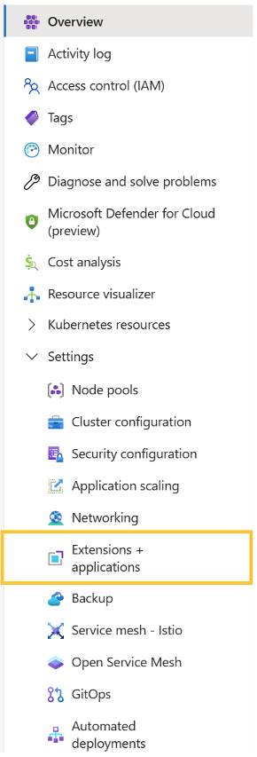

# Deploy PostgreSQL on an Azure Kubernetes Service (AKS) Cluster using Bitnami Marketplace K8s application

This guide demonstrates how to deploy PostgreSQL on an Azure Kubernetes Service (AKS) cluster using the Bitnami PostgreSQL Helm chart and includes instructions for basic usage.

PostgreSQL (Postgres) is an open source object-relational database known for reliability and data integrity. ACID-compliant, it supports foreign keys, joins, views, triggers and stored procedures.

## Prerequisites

Before you begin, ensure you have the following:

1. **Kubernetes cluster**: A running AKS Kubernetes cluster
2. **kubectl**: The Kubernetes command-line tool is installed and configured to interact with your cluster.
3. **PV provisioner** support in the underlying infrastructure

## Deployment and quick start

### Installing the Bitnami package for PostgreSQL extension using Marketplace

- Navigate to Azure Portal: [https://portal.azure.com](https://portal.azure.com/)
- Navigate to the running Azure Kubernetes Service (AKS) cluster where you would like to install the extension. More details about AKS can be found in [What is Azure Kubernetes Service (AKS)? - Azure Kubernetes Service \| Microsoft Learn](https://learn.microsoft.com/en-us/azure/aks/what-is-aks).

1. For more information on how to create a Kubernetes (AKS) Cluster, navigate to [Kubernetes on Azure tutorial - Create an Azure Kubernetes Service (AKS) cluster - Azure Kubernetes Service \| Microsoft Learn](https://learn.microsoft.com/en-us/azure/aks/tutorial-kubernetes-deploy-cluster?tabs=azure-cli)

- Under the “Settings” tab, select “Extensions + Applications”.



- Select “Add” located at the top left portion of the “Extensions + Applications” page.
- In the “Search the Marketplace” bar, search for “Bitnami package for PostgreSQL” and select the extension.
- Under Plan, select “Bitnami package for PostgreSQL” and select “Create”

#### Under “Basics” Tab

##### Project Details

1. For “Subscriptions”, select the subscription your AKS cluster is under. All resources in an Azure subscription are billed together.
2. For “Resource Group”, select the resource group your AKS cluster is under. A resource group is a collection of resources that share the same lifecycle, permissions, and policies.

##### Instance Details

1. If you would like to create a new AKS Cluster, select “Yes”. If you would like to use an existing cluster, select “No”.  
2. If Creating a New Kubernetes Cluster: For “Region” select the region to be used with the newly created AKS cluster.

#### Under “Kubernetes Cluster (AKS) Details” Tab

If Using an Existing Kubernetes Cluster

1. Kubernetes Cluster (AKS) Name: The resource name of the existing managed Kubernetes cluster (AKS) in which the extension will be installed.


If Creating a New Kubernetes Cluster

1. Kubernetes Cluster (AKS) Name: The name of a new managed Kubernetes cluster (AKS) in which the extension will be installed. Use only allowed characters.
2. Kubernetes version: The version of Kubernetes that should be used for this managed Kubernetes cluster. You will be able to upgrade this version after creating the cluster.
3. VM size: The size of virtual machine for the managed Kubernetes cluster nodes.
4. Enable auto scaling: Whether to enable auto-scaler for the number of nodes in the managed Kubernetes cluster.
5. Number of agents: Number agent nodes in the managed Kubernetes cluster.


#### Under “Application Details” Tab

1. Cluster extension resource name: Create a name for your extension resource
2. The value must not be empty.
3. Only lowercase alphanumeric characters are allowed, and the value must be 6-30 characters long.
4. Installation namespace: The Kubernetes namespace in which the extension will be installed. If the namespace does not exist, it will be created.
5. Allow extension auto upgrades of minor versions: Whether to allow auto upgrades of minor versions for the extension.
6. Application parameters (optional): Parameters are optional, for a quick start, the application can be launched with the default configuration. The link below lists the parameters that can be configured during installation for advanced customization. [charts/bitnami/postgresql at main · bitnami/charts](https://github.com/bitnami/charts/tree/main/bitnami/postgresql)
7. Enable multi line values: Enable this option when some of the parameter values specified above need to be multi line strings. It will be activated or deactivated for new rows.


#### Under “Usage Instructions” Tab

1. The deployment notes of this solution provide useful information regarding how to access the application and the different parameters that have been generated during the deployment. Please take a look at the following guide to know more about it.

[Usage instructions for Azure Marketplace Kubernetes Applications](https://docs.bitnami.com/azure/faq/get-started/usage-instructions-cnab/)


#### Under “Review + Create”

1. Review the information and select “Create” at the bottom right portion of the page to install the Bitnami package for PostgreSQL extension.

### Deploying Azure Resource Manager (ARM) Template with Azure CLI

Prerequisites

1. Kubernetes cluster: A running AKS Kubernetes cluster
2. Azure CLI: Azure command-line interface (Azure CLI) is a set of commands used to create and manage Azure resources. More information on Azure CLI can be found in [Azure Command-Line Interface (CLI) - Overview \| Microsoft Learn](https://learn.microsoft.com/en-us/cli/azure/).

Instructions

1. Create a resource group

```console
az group create  --name [insert resource group name] --location [insert location] 
```

1. Deploy the ARM Template

```console
az deployment group create --resource-group [insert resource group name] --template-file [path to ARM template file] 
```

### Installing the Bitnami package for PostgreSQL extension using Azure CLI

Prerequisites

Before you begin, ensure you have the following:

1. Kubernetes cluster: A running AKS Kubernetes cluster
2. Azure CLI: Azure command-line interface (Azure CLI) is a set of commands used to create and manage Azure resources. More information on Azure CLI can be found in [Azure Command-Line Interface (CLI) - Overview \| Microsoft Learn](https://learn.microsoft.com/en-us/cli/azure/).

To install the AKS extension, input the following command into the command line:

```console
az k8s-extension create
  --name [insert extension name]
  --extension-type Bitnami.PostgreSQLMain
  --scope namespace
  --cluster-name [insert existing AKS cluster name]
  --resource-group [insert resource group name]
  --cluster-type managedClusters
  --plan-name main
  --plan-product postgresql-cnab
  --plan-publisher bitnami
  --target-namespace postgresql

(optional) --configuration-settings [insert configuration settings]
```

Make sure to replace the placeholders (e.g., `[insert extension name]`, `[insert existing AKS cluster name]`, `[insert resource group name]`) with your specific details.

Example: `az k8s-extension create --name postgresql --extension-type Bitnami.PostgreSQLMain --scope namespace --cluster-name myAKScluster --resource-group myResourceGroup --cluster-type managedClusters --plan-name main --plan-product postgresql-cnab --plan-publisher bitnami --target-namespace postgresql --configuration-settings replicaCount=2 memoryHighWatermark.enabled="true" memoryHighWatermark.type="absolute" memoryHighWatermark.value="512Mi"`

### Terraform deployment

Prerequisites

1. **Terraform:** Feel free to refer to this guide for setup instructions: [Guide to Setting Up and Using Terraform and Azure CLI to Deploy a Kubernetes Cluster - Copy.docx](https://microsoft-my.sharepoint.com/:w:/r/personal/maanasagovi_microsoft_com/_layouts/15/Doc.aspx?sourcedoc=%7BE42D47A2-B605-47C8-AC8C-F612D3C11D7B%7D&file=Guide%20to%20Setting%20Up%20and%20Using%20Terraform%20and%20Azure%20CLI%20to%20Deploy%20a%20Kubernetes%20Cluster%20-%20Copy.docx&action=default&mobileredirect=true&share=IQGiRy3kBbbIR6yM9hLTwR17Ac4Au-OiH2pQPpFOnuOBMnA) **(or** [Install \| Terraform \| HashiCorp Developer](https://developer.hashicorp.com/terraform/install)**)**
2. **Azure CLI:** [How to install the Azure CLI \| Microsoft Learn](https://learn.microsoft.com/en-us/cli/azure/install-azure-cli)

#### Initialize Terraform

1. To initialize Terraform in the current directory where you have copied the k8s-extension-install sample run the following command:  

```console
terraform init  
```

1. Create a new directory for your Terraform configuration files and navigate to it.
2. Create a file named `main.tf` containing the following:

```text
provider "azurerm" {
  features {}
}

resource "azurerm_kubernetes_cluster" "aks" {
  name                = "[insert existing AKS cluster name]"
  location            = "[insert location]"
  resource_group_name = "[insert resource group name]"
  dns_prefix          = "aks"

  default_node_pool {
    name       = "default"
    node_count = 1
    vm_size    = "Standard_DS2_v2"
  }

  identity {
    type = "SystemAssigned"
  }
}

resource "azurerm_kubernetes_cluster_extension" "postgresql" {
  name                 = "[insert extension name]"
  kubernetes_cluster_id = azurerm_kubernetes_cluster.aks.id
  extension_type       = "Bitnami.PostgreSQLMain"
  scope {
    namespace = "postgresql"
  }
  plan {
    name      = "main"
    product   = "postgresql-cnab"
    publisher = "bitnami"
  }
  configuration_settings = {
    \# Add any configuration settings here
  }
}
```

1. Before you test run the main.tf file, you need to update the following in the tf file:  

**AKS cluster name** - The name of the AKS cluster.  
**Resource group name** - The name of the resource group where AKS cluster is located.  
**Extension name** - Name of the extension

## Deploy the application

1. Deploy the application with default configuration for azure-vote.  

```console
terraform apply 
```

### Access PostgreSQL

1. With default parameters PostgreSQL can be accessed via port 5432 on the following DNS names from within your cluster:

```text
postgresql.default.svc.cluster.local - Read/Write connection
```

1. To get the password for "postgres" run:

```console
export POSTGRES_PASSWORD=$(kubectl get secret --namespace default postgresql -o jsonpath="{.data.postgres-password}" | base64 -d)
```

1. To connect to your database run the following command:

```console
kubectl run postgresql-client --rm --tty -i --restart='Never' --namespace default --image docker.io/bitnami/postgresql:17.4.0-debian-12-r4 --env="PGPASSWORD=$POSTGRES_PASSWORD" --command -- psql --host postgresql -U postgres -d postgres -p 5432
```

> [!NOTE]
> If you access the container using bash, make sure that you execute "/opt/bitnami/scripts/postgresql/entrypoint.sh /bin/bash" in order to avoid the error "psql: local user with ID 1001} does not exist"

1. To connect to your database from outside the cluster execute the following commands:

```console
kubectl port-forward --namespace default svc/postgresql 5432:5432 &
PGPASSWORD="$POSTGRES_PASSWORD" psql --host 127.0.0.1 -U postgres -d postgres -p 5432
```

> [!IMPORTANT]
> Depending on the deployment parameters, you may need to adjust the above commands, such as changing the namespace or deployment name.

## Configuration and installation details

### Resource requests and limits

Bitnami charts allow setting resource requests and limits for all containers inside the chart deployment. These are inside the `resources` value (check parameter table). Setting requests is essential for production workloads and these should be adapted to your specific use case.

To make this process easier, the chart contains the `resourcesPreset` values, which automatically sets the `resources` section according to different presets. Check these presets in [the bitnami/common chart](https://github.com/bitnami/charts/blob/main/bitnami/common/templates/_resources.tpl#L15). However, in production workloads using `resourcesPreset` is discouraged as it may not fully adapt to your specific needs. Find more information on container resource management in the [official Kubernetes documentation](https://kubernetes.io/docs/concepts/configuration/manage-resources-containers/).

### Setting Pod's affinity

This chart allows you to set your custom affinity using the `XXX.affinity` parameter(s). Find more information about Pod's affinity in the [kubernetes documentation](https://kubernetes.io/docs/concepts/configuration/assign-pod-node/#affinity-and-anti-affinity).

As an alternative, you can use of the preset configurations for pod affinity, pod anti-affinity, and node affinity available at the [bitnami/common](https://github.com/bitnami/charts/tree/main/bitnami/common#affinities) chart. To do so, set the `XXX.podAffinityPreset`, `XXX.podAntiAffinityPreset`, or `XXX.nodeAffinityPreset` parameters.

### Customizing primary and read replica services in a replicated configuration

At the top level, there is a service object which defines the services for both primary and readReplicas. For deeper customization, there are service objects for both the primary and read types individually. This allows you to override the values in the top level service object so that the primary and read can be of different service types and with different clusterIPs / nodePorts. Also in the case you want the primary and read to be of type nodePort, you will need to set the nodePorts to different values to prevent a collision. The values that are deeper in the primary.service or readReplicas.service objects will take precedence over the top level service object.

### LDAP

LDAP support can be enabled in the chart by specifying the `ldap.` parameters while creating a release. The following parameters should be configured to properly enable the LDAP support in the chart.

- **ldap.enabled**: Enable LDAP support. Defaults to `false`.
- **ldap.uri**: LDAP URL beginning in the form `ldap[s]://<hostname>:<port>`. No defaults.
- **ldap.base**: LDAP base DN. No defaults.
- **ldap.binddn**: LDAP bind DN. No defaults.
- **ldap.bindpw**: LDAP bind password. No defaults.
- **ldap.bslookup**: LDAP base lookup. No defaults.
- **ldap.nss_initgroups_ignoreusers**: LDAP ignored users. `root,nslcd`.
- **ldap.scope**: LDAP search scope. No defaults.
- **ldap.tls_reqcert**: LDAP TLS check on server certificates. No defaults.

For example:

```yaml
ldap:
  enabled: "true"
  uri: "ldap://my_ldap_server"
  base: "dc=example,dc=org"
  binddn: "cn=admin,dc=example,dc=org"
  bindpw: "admin"
  bslookup: "ou=group-ok,dc=example,dc=org"
  nss_initgroups_ignoreusers: "root,nslcd"
  scope: "sub"
  tls_reqcert: "demand"
```

Next, login to the PostgreSQL server using the `psql` client and add the PAM authenticated LDAP users.

> [!NOTE]
> Parameters including commas must be escaped as shown in the above example.

### Update credentials

Bitnami charts, with its default settings, configure credentials at first boot. Any further change in the secrets or credentials can be done using one of the following methods:

#### Manual update of the passwords and secrets

- Update the user password following [the upstream documentation](https://www.postgresql.org/docs/current/sql-alteruser.html)
- Update the password secret with the new values (replace the SECRET_NAME, PASSWORD and POSTGRES_PASSWORD placeholders)

```console
kubectl create secret generic SECRET_NAME --from-literal=password=PASSWORD --from-literal=postgres-password=POSTGRES_PASSWORD --dry-run -o yaml | kubectl apply -f -
```

#### Automated update using a password update job

The Bitnami PostgreSQL provides a password update job that will automatically change the PostgreSQL passwords when running helm upgrade. To enable the job set `passwordUpdateJob.enabled=true`. This job requires:

- The new passwords: this is configured using either `auth.postgresPassword`, `auth.password` and `auth.replicationPassword` (if applicable) or setting `auth.existingSecret`.
- The previous passwords: This value is taken automatically from already deployed secret object. If you are using `auth.existingSecret` or `helm template` instead of `helm upgrade`, then set either `passwordUpdate.job.previousPasswords.postgresPassword`, `passwordUpdate.job.previousPasswords.password`, `passwordUpdate.job.previousPasswords.replicationPassword` (when applicable), or setting `passwordUpdateJob,previousPasswords.existingSecret`.

In the following example we update the password via values.yaml in a PostgreSQL installation with replication

```yaml
architecture: "replication"

auth:
  user: "user"
  postgresPassword: "newPostgresPassword123"
  password: "newUserPassword123"
  replicationPassword: "newReplicationPassword123"

passwordUpdateJob:
  enabled: true
```

In this example we use two existing secrets (`new-password-secret` and `previous-password-secret`) to update the passwords:

```yaml
auth:
  existingSecret: new-password-secret

passwordUpdateJob:
  enabled: true
  previousPasswords:
    existingSecret: previous-password-secret
```

You can add extra update commands using the `passwordUpdateJob.extraCommands` value.

### postgresql.conf / pg_hba.conf files as configMap

This helm chart also supports to customize the PostgreSQL configuration file. You can add additional PostgreSQL configuration parameters using the `primary.extendedConfiguration`/`readReplicas.extendedConfiguration` parameters as a string. Alternatively, to replace the entire default configuration use `primary.configuration`.

You can also add a custom pg_hba.conf using the `primary.pgHbaConfiguration` parameter.

In addition to these options, you can also set an external ConfigMap with all the configuration files. This is done by setting the `primary.existingConfigmap` parameter. Note that this will override the two previous options.

### Initialize a fresh instance

The [Bitnami PostgreSQL](https://github.com/bitnami/containers/tree/main/bitnami/postgresql) image allows you to use your custom scripts to initialize a fresh instance. In order to execute the scripts, you can specify custom scripts using the `primary.initdb.scripts` parameter as a string.

In addition, you can also set an external ConfigMap with all the initialization scripts. This is done by setting the `primary.initdb.scriptsConfigMap` parameter. Note that this will override the two previous options. If your initialization scripts contain sensitive information such as credentials or passwords, you can use the `primary.initdb.scriptsSecret` parameter.

The allowed extensions are `.sh`, `.sql` and `.sql.gz`.

### Securing traffic using TLS

TLS support can be enabled in the chart by specifying the `tls.` parameters while creating a release. The following parameters should be configured to properly enable the TLS support in the chart:

- `tls.enabled`: Enable TLS support. Defaults to `false`
- `tls.certificatesSecret`: Name of an existing secret that contains the certificates. No defaults.
- `tls.certFilename`: Certificate filename. No defaults.
- `tls.certKeyFilename`: Certificate key filename. No defaults.

For example:

- First, create the secret with the cetificates files:

    ```console
    kubectl create secret generic certificates-tls-secret --from-file=./cert.crt --from-file=./cert.key --from-file=./ca.crt
    ```

- Then, use the following parameters:

    ```yaml
    volumePermissions:
      enabled: true

    tls:
      enabled: true
      certificatesSecret: "certificates-tls-secret"
      certFilename: "cert.crt"
      certKeyFilename: "cert.key"
    ```

  > [!NOTE]
  > TLS and VolumePermissions: PostgreSQL requires certain permissions on sensitive files (such as certificate keys) to start up. Due to an on-going [issue](https://github.com/kubernetes/kubernetes/issues/57923) regarding kubernetes permissions and the use of `containerSecurityContext.runAsUser`, you must enable `volumePermissions` to ensure everything works as expected.

### Backup and restore

To back up and restore Bitnami PostgreSQL Helm chart deployments on Kubernetes, you need to back up the persistent volumes from the source deployment and attach them to a new deployment using [Velero](https://velero.io/), a Kubernetes backup/restore tool.

These are the steps you will usually follow to back up and restore your PostgreSQL cluster data:

- Install Velero on the source and destination clusters.
- Use Velero to back up the PersistentVolumes (PVs) used by the deployment on the source cluster.
- Use Velero to restore the backed-up PVs on the destination cluster.
- Create a new deployment on the destination cluster with the same chart, deployment name, credentials and other parameters as the original. This new deployment will use the restored PVs and hence the original data.

Refer to our detailed [tutorial on backing up and restoring PostgreSQL deployments on Kubernetes](https://techdocs.broadcom.com/us/en/vmware-tanzu/application-catalog/tanzu-application-catalog/services/tac-doc/apps-tutorials-migrate-data-tac-velero-index.html) for more information.

### NetworkPolicy

To enable network policy for PostgreSQL, install [a networking plugin that implements the Kubernetes NetworkPolicy spec](https://kubernetes.io/docs/tasks/administer-cluster/declare-network-policy#before-you-begin), and set `networkPolicy.enabled` to `true`.

For Kubernetes v1.5 & v1.6, you must also turn on NetworkPolicy by setting the DefaultDeny namespace annotation. Note: this will enforce policy for _all_ pods in the namespace:

```console
kubectl annotate namespace default "net.beta.kubernetes.io/network-policy={\"ingress\":{\"isolation\":\"DefaultDeny\"}}"
```

With NetworkPolicy enabled, traffic will be limited to just port 5432.

For more precise policy, set `networkPolicy.allowExternal=false`. This will only allow pods with the generated client label to connect to PostgreSQL.
This label will be displayed in the output of a successful install.

### Prometheus metrics

The chart optionally can start a metrics exporter for [prometheus](https://prometheus.io). The metrics endpoint (port 9187) is not exposed and it is expected that the metrics are collected from inside the k8s cluster using something similar as the described in the [example Prometheus scrape configuration](https://github.com/prometheus/prometheus/blob/master/documentation/examples/prometheus-kubernetes.yml).

The exporter allows to create custom metrics from additional SQL queries. See the Chart's `values.yaml` for an example and consult the [exporters documentation](https://github.com/wrouesnel/postgres_exporter#adding-new-metrics-via-a-config-file) for more details.

This chart can be integrated with Prometheus by setting `metrics.enabled` to `true`. This will deploy a sidecar container with [postgres_exporter](https://github.com/prometheus-community/postgres_exporter) in all pods. It will also create `metrics` services that can be configured under the `metrics.service` section. These services will be have the necessary annotations to be automatically scraped by Prometheus.

#### Prometheus requirements

It is necessary to have a working installation of Prometheus or Prometheus Operator for the integration to work. Install the [Bitnami Prometheus helm chart](https://github.com/bitnami/charts/tree/main/bitnami/prometheus) or the [Bitnami Kube Prometheus helm chart](https://github.com/bitnami/charts/tree/main/bitnami/kube-prometheus) to easily have a working Prometheus in your cluster.

#### Integration with Prometheus Operator

The chart can deploy `ServiceMonitor` objects for integration with Prometheus Operator installations. To do so, set the value `metrics.serviceMonitor.enabled=true`. Ensure that the Prometheus Operator `CustomResourceDefinitions` are installed in the cluster or it will fail with the following error:

```text
no matches for kind "ServiceMonitor" in version "monitoring.coreos.com/v1"
```

Install the [Bitnami Kube Prometheus helm chart](https://github.com/bitnami/charts/tree/main/bitnami/kube-prometheus) for having the necessary CRDs and the Prometheus Operator.
