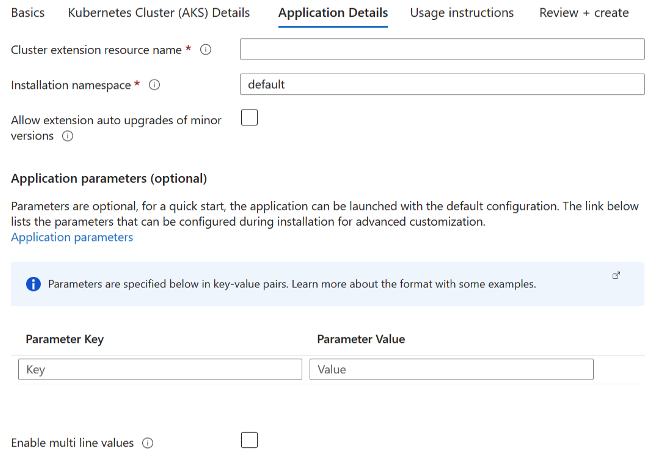
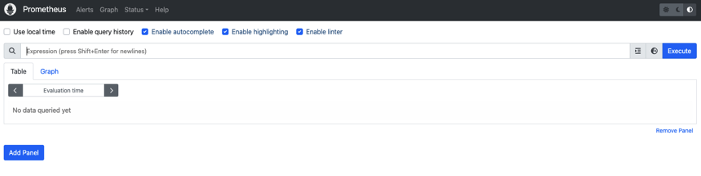

# Deploy Prometheus Operator on an Azure Kubernetes Service (AKS) Cluster using Bitnami Marketplace K8s application

This guide demonstrates how to deploy Prometheus Operator on an Azure Kubernetes Service (AKS) cluster using the Bitnami Prometheus Operator Helm chart and includes instructions for basic usage such as creating and consuming messages.  
  
Prometheus Operator provides easy monitoring definitions for Kubernetes services and deployment and management of Prometheus instances.

## Prerequisites

Before you begin, ensure you have the following:

1. **Kubernetes cluster**: A running AKS Kubernetes cluster
2. **kubectl**: The Kubernetes command-line tool is installed and configured to interact with your cluster.

## Deployment and quick start

### Installing the Bitnami package for Prometheus extension using Marketplace

- Navigate to Azure Portal: [https://portal.azure.com](https://portal.azure.com/)
- Navigate to the running Azure Kubernetes Service (AKS) cluster where you would like to install the extension. More details about AKS can be found in [What is Azure Kubernetes Service (AKS)? - Azure Kubernetes Service \| Microsoft Learn](https://learn.microsoft.com/en-us/azure/aks/what-is-aks).

1. For more information on how to create a Kubernetes (AKS) Cluster, navigate to [Kubernetes on Azure tutorial - Create an Azure Kubernetes Service (AKS) cluster - Azure Kubernetes Service \| Microsoft Learn](https://learn.microsoft.com/en-us/azure/aks/tutorial-kubernetes-deploy-cluster?tabs=azure-cli)

- Under the “Settings” tab, select “Extensions + Applications”.


- Select “Add” located at the top left portion of the “Extensions + Applications” page.
- In the “Search the Marketplace” bar, search for “Bitnami package for Prometheus Operator” and select the extension.
- Under Plan, select “Bitnami package for Prometheus Operator” and select “Create”

#### Under “Basics” Tab

##### Project Details

1. For “Subscriptions”, select the subscription your AKS cluster is under. All resources in an Azure subscription are billed together.
2. For “Resource Group”, select the resource group your AKS cluster is under. A resource group is a collection of resources that share the same lifecycle, permissions, and policies.

##### Instance Details

1. If you would like to create a new AKS Cluster, select “Yes”. If you would like to use an existing cluster, select “No”.  
2. If Creating a New Kubernetes Cluster: For “Region” select the region to be used with the newly created AKS cluster.

#### Under “Kubernetes Cluster (AKS) Details” Tab

If Using an Existing Kubernetes Cluster

1. Kubernetes Cluster (AKS) Name: The resource name of the existing managed Kubernetes cluster (AKS) in which the extension will be installed.


If Creating a New Kubernetes Cluster

1. Kubernetes Cluster (AKS) Name: The name of a new managed Kubernetes cluster (AKS) in which the extension will be installed. Use only allowed characters.
2. Kubernetes version: The version of Kubernetes that should be used for this managed Kubernetes cluster. You will be able to upgrade this version after creating the cluster.
3. VM size: The size of virtual machine for the managed Kubernetes cluster nodes.
4. Enable auto scaling: Whether to enable auto-scaler for the number of nodes in the managed Kubernetes cluster.
5. Number of agents: Number agent nodes in the managed Kubernetes cluster.


#### Under “Application Details” Tab

1. Cluster extension resource name: Create a name for your extension resource
2. The value must not be empty.
3. Only lowercase alphanumeric characters are allowed, and the value must be 6-30 characters long.
4. Installation namespace: The Kubernetes namespace in which the extension will be installed. If the namespace does not exist, it will be created.
5. Allow extension auto upgrades of minor versions: Whether to allow auto upgrades of minor versions for the extension.
6. Application parameters (optional): Parameters are optional, for a quick start, the application can be launched with the default configuration. The link below lists the parameters that can be configured during installation for advanced customization. [charts/bitnami/prometheus at main · bitnami/charts](https://github.com/bitnami/charts/tree/main/bitnami/prometheus)
7. Enable multi line values: Enable this option when some of the parameter values specified above need to be multi line strings. It will be activated or deactivated for new rows.



#### Under “Usage Instructions” Tab

1. The deployment notes of this solution provide useful information regarding how to access the application and the different parameters that have been generated during the deployment. Please take a look at the following guide to know more about it.

[Usage instructions for Azure Marketplace Kubernetes Applications](https://docs.bitnami.com/azure/faq/get-started/usage-instructions-cnab/)


#### Under “Review + Create”

1. Review the information and select “Create” at the bottom right portion of the page to install the Bitnami package for Prometheus Operator extension.

### Deploying Azure Resource Manager (ARM) Template with Azure CLI

Prerequisites:

1. Kubernetes cluster: A running AKS Kubernetes cluster
2. Azure CLI: Azure command-line interface (Azure CLI) is a set of commands used to create and manage Azure resources. More information on Azure CLI can be found in [Azure Command-Line Interface (CLI) - Overview \| Microsoft Learn](https://learn.microsoft.com/en-us/cli/azure/).

Instructions

1. Create a resource group

```console
az group create  --name \[insert resource group name\] --location \[insert location\]
```

1. Deploy the ARM Template

```console
az deployment group create --resource-group \[insert resource group name\] --template-file \[path to ARM template file\]
```

### Installing the Bitnami package for MinIO&reg; extension using Azure CLI

Prerequisites

Before you begin, ensure you have the following:

1. Kubernetes cluster: A running AKS Kubernetes cluster

2. Azure CLI: Azure command-line interface (Azure CLI) is a set of commands used to create and manage Azure resources. More information on Azure CLI can be found in [Azure Command-Line Interface (CLI) - Overview \| Microsoft Learn](https://learn.microsoft.com/en-us/cli/azure/).

To install the AKS extension, input the following command into the command line:

```console
az k8s-extension create  
  --name \[insert extension name\]  
  --extension-type Bitnami.Prometheus
  --scope namespace  
  --cluster-name \[insert existing AKS cluster name\]  
  --resource-group \[insert resource group name\]  
  --cluster-type managedClusters  
  --plan-name main  
  --plan-product prometheus-operator-cnab
  --plan-publisher bitnami  
  --target-namespace prometheus-operator

(optional) --configuration-settings \[insert configuration settings\]
```

Make sure to replace the placeholders (e.g., `[insert extension name]`, `[insert existing AKS cluster name]`, `[insert resource group name]`) with your specific details.

Example: `az k8s-extension create –name prometheus-operator2 --extension-type Bitnami.Prometheus --scope namespace --cluster-name myAKScluster --resource-group myResourceGroup --cluster-type managedClusters --plan-name main --plan-product prometheus-operator-cnab --plan-publisher bitnami --target-namespace prometheus-operator --configuration-settings replicaCount=2 memoryHighWatermark.enabled="true" memoryHighWatermark.type="absolute" memoryHighWatermark.value="512Mi"`

### Terraform deployment

Prerequisites

1. **Terraform:** Feel free to refer to this guide for setup instructions: [Guide to Setting Up and Using Terraform and Azure CLI to Deploy a Kubernetes Cluster - Copy.docx](https://microsoft-my.sharepoint.com/:w:/r/personal/maanasagovi_microsoft_com/_layouts/15/Doc.aspx?sourcedoc=%7BE42D47A2-B605-47C8-AC8C-F612D3C11D7B%7D&file=Guide%20to%20Setting%20Up%20and%20Using%20Terraform%20and%20Azure%20CLI%20to%20Deploy%20a%20Kubernetes%20Cluster%20-%20Copy.docx&action=default&mobileredirect=true&share=IQGiRy3kBbbIR6yM9hLTwR17Ac4Au-OiH2pQPpFOnuOBMnA) **(or** [Install \| Terraform \| HashiCorp Developer](https://developer.hashicorp.com/terraform/install)**)**
2. **Azure CLI:** [How to install the Azure CLI \| Microsoft Learn](https://learn.microsoft.com/en-us/cli/azure/install-azure-cli)

#### Initialize Terraform

1. To initialize Terraform in the current directory where you have copied the k8s-extension-install sample run the following command:  

```console
terraform init  
```

1. Create a new directory for your Terraform configuration files and navigate to it.

2. Create a file named main.tf containing the following:

```text
provider "azurerm" {
  features {}
}

resource "azurerm_kubernetes_cluster" "aks" {
  name                = "\[insert existing AKS cluster name\]"
  location            = "\[insert location\]"
  resource_group_name = "\[insert resource group name\]"
  dns_prefix          = "aks"

  default_node_pool {
    name       = "default"
    node_count = 1
    vm_size    = "Standard_DS2_v2"
  }

  identity {
    type = "SystemAssigned"
  }
}

resource "azurerm_kubernetes_cluster_extension" "prometheus-operator" {
  name                 = "\[insert extension name\]"
  kubernetes_cluster_id = azurerm_kubernetes_cluster.aks.id
  extension_type       = "Bitnami.Prometheus"
  scope {
    namespace = "prometheus-operator"
  }
  plan {
    name      = "main"
    product   = "prometheus-operator-cnab"
    publisher = "bitnami"
  }
  configuration_settings = {
    \# Add any configuration settings here
  }
}
```

1. Before you test run the main.tf file, you need to update the following in the tf file:  

**AKS cluster name** - The name of the AKS cluster.  
**Resource group name** - The name of the resource group where AKS cluster is located.  
**Extension name** - Name of the extension

## Deploy the application

1. Deploy the application with default configuration for azure-vote.  

```console
terraform apply 
```

### Access Prometheus and Alertmanager

1. Once deployed, you can access Prometheus via port 9090:



1. In the same way, Alertmanager is accessible at port 9093:


## Configuration and installation details

### Resource requests and limits

Bitnami charts allow setting resource requests and limits for all containers inside the chart deployment. These are inside the `resources` value (check parameter table). Setting requests is essential for production workloads and these should be adapted to your specific use case.

To make this process easier, the chart contains the `resourcesPreset` values, which automatically sets the `resources` section according to different presets. Check these presets in [the bitnami/common chart](https://github.com/bitnami/charts/blob/main/bitnami/common/templates/_resources.tpl#L15). However, in production workloads using `resourcesPreset` is discouraged as it may not fully adapt to your specific needs. Find more information on container resource management in the [official Kubernetes documentation](https://kubernetes.io/docs/concepts/configuration/manage-resources-containers/).

### Set pod affinity

This chart allows setting custom Pod affinity using the `XXX.affinity` parameter(s). Find more information about Pod's affinity in the [Kubernetes documentation](https://kubernetes.io/docs/concepts/configuration/assign-pod-node/#affinity-and-anti-affinity).

As an alternative, use one of the preset configurations for pod affinity, pod anti-affinity, and node affinity available at the [bitnami/common](https://github.com/bitnami/charts/tree/main/bitnami/common#affinities) chart. To do so, set the `XXX.podAffinityPreset`, `XXX.podAntiAffinityPreset`, or `XXX.nodeAffinityPreset` parameters.

### Additional scrape configurations

It is possible to inject externally managed scrape configurations via a Secret by setting `prometheus.additionalScrapeConfigs.enabled` to `true` and `prometheus.additionalScrapeConfigs.type` to `external`. The secret must exist in the same namespace as the chart deployment. Set the secret name using the parameter `prometheus.additionalScrapeConfigs.external.name`, and the key containing the additional scrape configuration using the `prometheus.additionalScrapeConfigs.external.key`.

```text
prometheus.additionalScrapeConfigs.enabled=true
prometheus.additionalScrapeConfigs.type=external
prometheus.additionalScrapeConfigs.external.name=kube-prometheus-prometheus-scrape-config
prometheus.additionalScrapeConfigs.external.key=additional-scrape-configs.yaml
```

It is also possible to define scrape configurations to be managed by the Helm chart by setting `prometheus.additionalScrapeConfigs.enabled` to `true` and `prometheus.additionalScrapeConfigs.type` to `internal`. You can then use `prometheus.additionalScrapeConfigs.internal.jobList` to define a list of additional scrape jobs for Prometheus.

```text
prometheus.additionalScrapeConfigs.enabled=true
prometheus.additionalScrapeConfigs.type=internal
prometheus.additionalScrapeConfigs.internal.jobList=
      - job_name: 'opentelemetry-collector'
        # metrics_path defaults to '/metrics'
        # scheme defaults to 'http'.
        static_configs:
          - targets: ['opentelemetry-collector:8889']
```

For more information, see the [additional scrape configuration documentation](https://github.com/prometheus-operator/prometheus-operator/blob/master/Documentation/additional-scrape-config.md).

### Additional alert relabel configurations

It is possible to inject externally managed Prometheus alert relabel configurations via a Secret by setting `prometheus.additionalAlertRelabelConfigsExternal.enabled` to `true`. The secret must exist in the same namespace as the chart deployment.

Set the secret name using the parameter `prometheus.additionalAlertRelabelConfigsExternal.name`, and the key containing the additional alert relabel configuration using the `prometheus.additionalAlertRelabelConfigsExternal.key`. For instance, if you created a secret named `kube-prometheus-prometheus-alert-relabel-config` and it contains a file named `additional-alert-relabel-configs.yaml`, use the parameters below:

```text
prometheus.additionalAlertRelabelConfigsExternal.enabled=true
prometheus.additionalAlertRelabelConfigsExternal.name=kube-prometheus-prometheus-alert-relabel-config
prometheus.additionalAlertRelabelConfigsExternal.key=additional-alert-relabel-configs.yaml
```

### Backup and restore

To back up and restore Helm chart deployments on Kubernetes, you need to back up the persistent volumes from the source deployment and attach them to a new deployment using [Velero](https://velero.io/), a Kubernetes backup/restore tool. Find the instructions for using Velero in [this guide](https://techdocs.broadcom.com/us/en/vmware-tanzu/application-catalog/tanzu-application-catalog/services/tac-doc/apps-tutorials-backup-restore-deployments-velero-index.html).

### Additional environment variables

In case you want to add extra environment variables (useful for advanced operations like custom init scripts), you can use the `extraEnvVars` property.

```yaml
extraEnvVars:
  - name: PROM_LOG_LEVEL
    value: DEBUG
```

Alternatively, you can use a ConfigMap or a Secret with the environment variables. To do so, use the `extraEnvVarsCM` or the `extraEnvVarsSecret` values.

### Deploying extra resources

There are cases where you may want to deploy extra objects, such a ConfigMap containing your app's configuration or some extra deployment with a micro service used by your app. For covering this case, the chart allows adding the full specification of other objects using the `extraDeploy` parameter.
