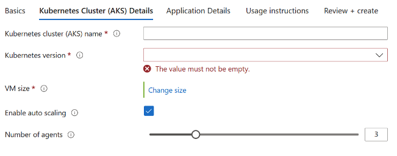

# Deploy Redis&reg; on an Azure Kubernetes Service (AKS) Cluster using Bitnami Marketplace K8s application

This guide demonstrates how to deploy Redis&reg; on an Azure Kubernetes Service (AKS) cluster using the Bitnami Redis&reg; Helm chart and includes instructions for basic usage.

Redis&reg; is an open source, advanced key-value store. It is often referred to as a data structure server since keys can contain strings, hashes, lists, sets and sorted sets.

## Prerequisites

Before you begin, ensure you have the following:

1. **Kubernetes cluster**: A running AKS Kubernetes cluster
2. **kubectl**: The Kubernetes command-line tool is installed and configured to interact with your cluster.
3. **PV provisioner** support in the underlying infrastructure

## Deployment and quick start

### Installing the Bitnami package for Redis&reg; extension using Marketplace

- Navigate to Azure Portal: [https://portal.azure.com](https://portal.azure.com/)
- Navigate to the running Azure Kubernetes Service (AKS) cluster where you would like to install the extension. More details about AKS can be found in [What is Azure Kubernetes Service (AKS)? - Azure Kubernetes Service \| Microsoft Learn](https://learn.microsoft.com/en-us/azure/aks/what-is-aks).

1. For more information on how to create a Kubernetes (AKS) Cluster, navigate to [Kubernetes on Azure tutorial - Create an Azure Kubernetes Service (AKS) cluster - Azure Kubernetes Service \| Microsoft Learn](https://learn.microsoft.com/en-us/azure/aks/tutorial-kubernetes-deploy-cluster?tabs=azure-cli)

- Under the “Settings” tab, select “Extensions + Applications”.


- Select “Add” located at the top left portion of the “Extensions + Applications” page.
- In the “Search the Marketplace” bar, search for “Bitnami package for Redis&reg;” and select the extension.
- Under Plan, select “Bitnami package for Redis&reg;” and select “Create”

#### Under “Basics” Tab

##### Project Details

1. For “Subscriptions”, select the subscription your AKS cluster is under. All resources in an Azure subscription are billed together.
2. For “Resource Group”, select the resource group your AKS cluster is under. A resource group is a collection of resources that share the same lifecycle, permissions, and policies.

##### Instance Details

1. If you would like to create a new AKS Cluster, select “Yes”. If you would like to use an existing cluster, select “No”.  
2. If Creating a New Kubernetes Cluster: For “Region” select the region to be used with the newly created AKS cluster.

#### Under “Kubernetes Cluster (AKS) Details” Tab

If Using an Existing Kubernetes Cluster

1. Kubernetes Cluster (AKS) Name: The resource name of the existing managed Kubernetes cluster (AKS) in which the extension will be installed.


If Creating a New Kubernetes Cluster

1. Kubernetes Cluster (AKS) Name: The name of a new managed Kubernetes cluster (AKS) in which the extension will be installed. Use only allowed characters.
2. Kubernetes version: The version of Kubernetes that should be used for this managed Kubernetes cluster. You will be able to upgrade this version after creating the cluster.
3. VM size: The size of virtual machine for the managed Kubernetes cluster nodes.
4. Enable auto scaling: Whether to enable auto-scaler for the number of nodes in the managed Kubernetes cluster.
5. Number of agents: Number agent nodes in the managed Kubernetes cluster.



#### Under “Application Details” Tab

1. Cluster extension resource name: Create a name for your extension resource
2. The value must not be empty.
3. Only lowercase alphanumeric characters are allowed, and the value must be 6-30 characters long.
4. Installation namespace: The Kubernetes namespace in which the extension will be installed. If the namespace does not exist, it will be created.
5. Allow extension auto upgrades of minor versions: Whether to allow auto upgrades of minor versions for the extension.
6. Application parameters (optional): Parameters are optional, for a quick start, the application can be launched with the default configuration. The link below lists the parameters that can be configured during installation for advanced customization. [charts/bitnami/redis at main · bitnami/charts](https://github.com/bitnami/charts/tree/main/bitnami/redis)
7. Enable multi line values: Enable this option when some of the parameter values specified above need to be multi line strings. It will be activated or deactivated for new rows.


#### Under “Usage Instructions” Tab

1. The deployment notes of this solution provide useful information regarding how to access the application and the different parameters that have been generated during the deployment. Please take a look at the following guide to know more about it.

[Usage instructions for Azure Marketplace Kubernetes Applications](https://docs.bitnami.com/azure/faq/get-started/usage-instructions-cnab/)


#### Under “Review + Create”

1. Review the information and select “Create” at the bottom right portion of the page to install the Bitnami package for Redis&reg; extension.

### Deploying Azure Resource Manager (ARM) Template with Azure CLI

Prerequisites

1. Kubernetes cluster: A running AKS Kubernetes cluster
2. Azure CLI: Azure command-line interface (Azure CLI) is a set of commands used to create and manage Azure resources. More information on Azure CLI can be found in [Azure Command-Line Interface (CLI) - Overview \| Microsoft Learn](https://learn.microsoft.com/en-us/cli/azure/).

Instructions

1. Create a resource group

```console
az group create  --name [insert resource group name] --location [insert location] 
```

1. Deploy the ARM Template

```console
az deployment group create --resource-group [insert resource group name] --template-file [path to ARM template file] 
```

### Installing the Bitnami package for Redis&reg; extension using Azure CLI

Prerequisites

Before you begin, ensure you have the following:

1. Kubernetes cluster: A running AKS Kubernetes cluster
2. Azure CLI: Azure command-line interface (Azure CLI) is a set of commands used to create and manage Azure resources. More information on Azure CLI can be found in [Azure Command-Line Interface (CLI) - Overview \| Microsoft Learn](https://learn.microsoft.com/en-us/cli/azure/).

To install the AKS extension, input the following command into the command line:

```console
az k8s-extension create
  --name [insert extension name]
  --extension-type Bitnami.RedisMain
  --scope namespace
  --cluster-name [insert existing AKS cluster name]
  --resource-group [insert resource group name]
  --cluster-type managedClusters
  --plan-name main
  --plan-product redis-cnab
  --plan-publisher bitnami
  --target-namespace redis

(optional) --configuration-settings [insert configuration settings]
```

Make sure to replace the placeholders (e.g., `[insert extension name]`, `[insert existing AKS cluster name]`, `[insert resource group name]`) with your specific details.

Example: `az k8s-extension create --name redis --extension-type Bitnami.RedisMain --scope namespace --cluster-name myAKScluster --resource-group myResourceGroup --cluster-type managedClusters --plan-name main --plan-product redis-cnab --plan-publisher bitnami --target-namespace redis --configuration-settings replicaCount=2 memoryHighWatermark.enabled="true" memoryHighWatermark.type="absolute" memoryHighWatermark.value="512Mi"`

### Terraform deployment

Prerequisites

1. **Terraform:** Feel free to refer to this guide for setup instructions: [Guide to Setting Up and Using Terraform and Azure CLI to Deploy a Kubernetes Cluster - Copy.docx](https://microsoft-my.sharepoint.com/:w:/r/personal/maanasagovi_microsoft_com/_layouts/15/Doc.aspx?sourcedoc=%7BE42D47A2-B605-47C8-AC8C-F612D3C11D7B%7D&file=Guide%20to%20Setting%20Up%20and%20Using%20Terraform%20and%20Azure%20CLI%20to%20Deploy%20a%20Kubernetes%20Cluster%20-%20Copy.docx&action=default&mobileredirect=true&share=IQGiRy3kBbbIR6yM9hLTwR17Ac4Au-OiH2pQPpFOnuOBMnA) **(or** [Install \| Terraform \| HashiCorp Developer](https://developer.hashicorp.com/terraform/install)**)**
2. **Azure CLI:** [How to install the Azure CLI \| Microsoft Learn](https://learn.microsoft.com/en-us/cli/azure/install-azure-cli)

#### Initialize Terraform

1. To initialize Terraform in the current directory where you have copied the k8s-extension-install sample run the following command:  

```console
terraform init  
```

1. Create a new directory for your Terraform configuration files and navigate to it.
2. Create a file named `main.tf` containing the following:

```text
provider "azurerm" {
  features {}
}

resource "azurerm_kubernetes_cluster" "aks" {
  name                = "[insert existing AKS cluster name]"
  location            = "[insert location]"
  resource_group_name = "[insert resource group name]"
  dns_prefix          = "aks"

  default_node_pool {
    name       = "default"
    node_count = 1
    vm_size    = "Standard_DS2_v2"
  }

  identity {
    type = "SystemAssigned"
  }
}

resource "azurerm_kubernetes_cluster_extension" "redis" {
  name                 = "[insert extension name]"
  kubernetes_cluster_id = azurerm_kubernetes_cluster.aks.id
  extension_type       = "Bitnami.RedisMain"
  scope {
    namespace = "redis"
  }
  plan {
    name      = "main"
    product   = "redis-cnab"
    publisher = "bitnami"
  }
  configuration_settings = {
    \# Add any configuration settings here
  }
}
```

1. Before you test run the main.tf file, you need to update the following in the tf file:  

**AKS cluster name** - The name of the AKS cluster.  
**Resource group name** - The name of the resource group where AKS cluster is located.  
**Extension name** - Name of the extension

## Deploy the application

1. Deploy the application with default configuration for azure-vote.  

```console
terraform apply 
```

### Access Redis&reg;

1. Get Redis&reg; root password:

```console
export REDIS_PASSWORD=$(kubectl get secret --namespace default redis -o jsonpath="{.data.redis-password}" | base64 -d)
```

1. Run a Redis&reg; pod that you can use as a client:

```console
kubectl run --namespace default redis-client --restart='Never'  --env REDIS_PASSWORD=$REDIS_PASSWORD  --image docker.io/bitnami/redis:7.4.2-debian-12-r4 --command -- sleep infinity
```

1. Use the following command to attach to the pod:

```console
kubectl exec --tty -i redis-client --namespace default -- bash
```

1. Connect using the Redis&reg; CLI:

```console
REDISCLI_AUTH="$REDIS_PASSWORD" redis-cli -h redis-master
REDISCLI_AUTH="$REDIS_PASSWORD" redis-cli -h redis-replicas
```

1. To connect to your database from outside the cluster execute the following commands:

```console
kubectl port-forward --namespace default svc/redis-master 6379:6379 &
REDISCLI_AUTH="$REDIS_PASSWORD" redis-cli -h 127.0.0.1 -p 6379nsole
```

> [!IMPORTANT]
> Depending on the deployment parameters, you may need to adjust the above commands, such as changing the namespace or deployment name.

## Configuration and installation details

### Resource requests and limits

Bitnami charts allow setting resource requests and limits for all containers inside the chart deployment. These are inside the `resources` value (check parameter table). Setting requests is essential for production workloads and these should be adapted to your specific use case.

To make this process easier, the chart contains the `resourcesPreset` values, which automatically sets the `resources` section according to different presets. Check these presets in [the bitnami/common chart](https://github.com/bitnami/charts/blob/main/bitnami/common/templates/_resources.tpl#L15). However, in production workloads using `resourcesPreset` is discouraged as it may not fully adapt to your specific needs. Find more information on container resource management in the [official Kubernetes documentation](https://kubernetes.io/docs/concepts/configuration/manage-resources-containers/).

### Bootstrapping with an External Cluster

This chart is equipped with the ability to bring online a set of Pods that connect to an existing Redis deployment that lies outside of Kubernetes.  This effectively creates a hybrid Redis Deployment where both Pods in Kubernetes and Instances such as Virtual Machines can partake in a single Redis Deployment. This is helpful in situations where one may be migrating Redis from Virtual Machines into Kubernetes, for example.  To take advantage of this, use the following as an example configuration:

```yaml
replica:
  externalMaster:
    enabled: true
    host: external-redis-0.internal
sentinel:
  externalMaster:
    enabled: true
    host: external-redis-0.internal
```

> [!WARNING]
> This is currently limited to clusters in which Sentinel and Redis run on the same node! :warning:

Please also note that the external sentinel must be listening on port `26379`, and this is currently not configurable.

Once the Kubernetes Redis Deployment is online and confirmed to be working with the existing cluster, the configuration can then be removed and the cluster will remain connected.

### External DNS

This chart is equipped to allow leveraging the ExternalDNS project. Doing so will enable ExternalDNS to publish the FQDN for each instance, in the format of `<pod-name>.<release-name>.<dns-suffix>`.
Example, when using the following configuration:

```yaml
useExternalDNS:
  enabled: true
  suffix: prod.example.org
  additionalAnnotations:
    ttl: 10
```

On a cluster where the name of the Helm release is `a`, the hostname of a Pod is generated as: `a-redis-node-0.a-redis.prod.example.org`. The IP of that FQDN will match that of the associated Pod. This modifies the following parameters of the Redis/Sentinel configuration using this new FQDN:

- `replica-announce-ip`
- `known-sentinel`
- `known-replica`
- `announce-ip`

> [!WARNING]
> This requires a working installation of `external-dns` to be fully functional. :warning:

See the [official ExternalDNS documentation](https://github.com/kubernetes-sigs/external-dns) for additional configuration options.

### Cluster topologies

#### Default: Master-Replicas

When installing the chart with `architecture=replication`, it will deploy a Redis&reg; master StatefulSet and a Redis&reg; replicas StatefulSet. The replicas will be read-replicas of the master. Two services will be exposed:

- Redis&reg; Master service: Points to the master, where read-write operations can be performed
- Redis&reg; Replicas service: Points to the replicas, where only read operations are allowed by default.

In case the master crashes, the replicas will wait until the master node is respawned again by the Kubernetes Controller Manager.

#### Standalone

When installing the chart with `architecture=standalone`, it will deploy a standalone Redis&reg; StatefulSet. A single service will be exposed:

- Redis&reg; Master service: Points to the master, where read-write operations can be performed

#### Master-Replicas with Sentinel

When installing the chart with `architecture=replication` and `sentinel.enabled=true`, it will deploy a Redis&reg; master StatefulSet (only one master allowed) and a Redis&reg; replicas StatefulSet. In this case, the pods will contain an extra container with Redis&reg; Sentinel. This container will form a cluster of Redis&reg; Sentinel nodes, which will promote a new master in case the actual one fails.

On graceful termination of the Redis&reg; master pod, a failover of the master is initiated to promote a new master. The Redis&reg; Sentinel container in this pod will wait for the failover to occur before terminating. If `sentinel.redisShutdownWaitFailover=true` is set (the default), the Redis&reg; container will wait for the failover as well before terminating. This increases availability for reads during failover, but may cause stale reads until all clients have switched to the new master.

In addition to this, only one service is exposed:

- Redis&reg; service: Exposes port 6379 for Redis&reg; read-only operations and port 26379 for accessing Redis&reg; Sentinel.

For read-only operations, access the service using port 6379. For write operations, it's necessary to access the Redis&reg; Sentinel cluster and query the current master using the command below (using redis-cli or similar):

```console
SENTINEL get-master-addr-by-name <name of your MasterSet. e.g: mymaster>
```

This command will return the address of the current master, which can be accessed from inside the cluster.

In case the current master crashes, the Sentinel containers will elect a new master node.

`master.count` greater than `1` is not designed for use when `sentinel.enabled=true`.

### Multiple masters (experimental)

When `master.count` is greater than `1`, special care must be taken to create a consistent setup.

An example of use case is the creation of a redundant set of standalone masters or master-replicas per Kubernetes node where you must ensure:

- No more than `1` master can be deployed per Kubernetes node
- Replicas and writers can only see the single master of their own Kubernetes node

One way of achieving this is by setting `master.service.internalTrafficPolicy=Local` in combination with a `master.affinity.podAntiAffinity` spec to never schedule more than one master per Kubernetes node.

It's recommended to only change `master.count` if you know what you are doing.
`master.count` greater than `1` is not designed for use when `sentinel.enabled=true`.

### Using a password file

To use a password file for Redis&reg; you need to create a secret containing the password and then deploy the chart using that secret. Follow these instructions:

- Create the secret with the password. It is important that the file with the password must be called `redis-password`.

```console
kubectl create secret generic redis-password-secret --from-file=redis-password.yaml
```

- Deploy the Helm Chart using the secret name as parameter:

```yaml
usePassword: true
usePasswordFiles: true
existingSecret: redis-password-secret
sentinels:
  enabled: true
metrics:
  enabled: true
```

### Securing traffic using TLS

TLS support can be enabled in the chart by specifying the `tls.` parameters while creating a release. The following parameters should be configured to properly enable the TLS support in the cluster:

- `tls.enabled`: Enable TLS support. Defaults to `false`
- `tls.existingSecret`: Name of the secret that contains the certificates. No defaults.
- `tls.certFilename`: Certificate filename. No defaults.
- `tls.certKeyFilename`: Certificate key filename. No defaults.
- `tls.certCAFilename`: CA Certificate filename. No defaults.

For example:

First, create the secret with the certificates files:

```console
kubectl create secret generic certificates-tls-secret --from-file=./cert.pem --from-file=./cert.key --from-file=./ca.pem
```

Then, use the following parameters:

```yaml
tls:
  enabled: "true"
  existingSecret: "certificates-tls-secret"
  certFilename: "cert.pem"
  certKeyFilename: "cert.key"
  certCAFilename: "ca.pem"
```

### Host Kernel Settings

Redis&reg; may require some changes in the kernel of the host machine to work as expected, in particular increasing the `somaxconn` value and disabling transparent huge pages. To do so, you can set up a privileged `initContainer` with the `sysctlImage` config values, for example:

```yaml
sysctlImage:
  enabled: true
  mountHostSys: true
  command:
    - /bin/sh
    - -c
    - |-
      install_packages procps
      sysctl -w net.core.somaxconn=10000
      echo never > /host-sys/kernel/mm/transparent_hugepage/enabled
```

Alternatively, for Kubernetes 1.12+ you can set `securityContext.sysctls` which will configure `sysctls` for master and slave pods. Example:

```yaml
securityContext:
  sysctls:
  - name: net.core.somaxconn
    value: "10000"
```

Note that this will not disable transparent huge tables.

### Backup and restore

To backup and restore Redis deployments on Kubernetes, you will need to create a snapshot of the data in the source cluster, and later restore it in a new cluster with the new parameters. Follow the instructions below:

#### Step 1: Backup the deployment

- Connect to one of the nodes and start the Redis CLI tool. Then, run the commands below:

    ```console
    $ kubectl exec -it my-release-master-0 bash
    $ redis-cli
    127.0.0.1:6379> auth your_current_redis_password
    OK
    127.0.0.1:6379> save
    OK
    ```

- Copy the dump file from the Redis node:

    ```console
    kubectl cp my-release-master-0:/data/dump.rdb dump.rdb -c redis
    ```

#### Step 2: Restore the data on the destination cluster

To restore the data in a new cluster, you will need to create a PVC and then upload the *dump.rdb* file to the new volume.

Follow the following steps:

- In the [*values.yaml*](https://github.com/bitnami/charts/blob/main/bitnami/redis/values.yaml) file set the *appendonly* parameter to *no*. You can skip this step if it is already configured as *no*

    ```yaml
    commonConfiguration: |-
       # Enable AOF https://redis.io/topics/persistence#append-only-file
       appendonly no
       # Disable RDB persistence, AOF persistence already enabled.
       save ""
    ```

    > [!NOTE]
    > The `Enable AOF` comment belongs to the original config file and what you're actually doing is disabling it. This change will only be neccessary for the temporal cluster you're creating to upload the dump.*

- Start the new cluster to create the PVCs.

- Now that the PVC were created, stop it and copy the *dump.rdp* file on the persisted data by using a helping pod.

  ```console
  $ kubectl run --generator=run-pod/v1 -i --rm --tty volpod --overrides='
  {
      "apiVersion": "v1",
      "kind": "Pod",
      "metadata": {
          "name": "redisvolpod"
      },
      "spec": {
          "containers": [{
             "command": [
                  "tail",
                  "-f",
                  "/dev/null"
             ],
             "image": "bitnami/minideb",
             "name": "mycontainer",
             "volumeMounts": [{
                 "mountPath": "/mnt",
                 "name": "redisdata"
              }]
          }],
          "restartPolicy": "Never",
          "volumes": [{
              "name": "redisdata",
              "persistentVolumeClaim": {
                  "claimName": "redis-data-new-redis-master-0"
              }
          }]
      }
  }' --image="bitnami/minideb"

  $ kubectl cp dump.rdb redisvolpod:/mnt/dump.rdb
  $ kubectl delete pod volpod
  ```

- Restart the cluster

### NetworkPolicy

To enable network policy for Redis&reg;, install [a networking plugin that implements the Kubernetes NetworkPolicy spec](https://kubernetes.io/docs/tasks/administer-cluster/declare-network-policy#before-you-begin), and set `networkPolicy.enabled` to `true`.

With NetworkPolicy enabled, only pods with the generated client label will be able to connect to Redis. This label will be displayed in the output after a successful install.

With `networkPolicy.ingressNSMatchLabels` pods from other namespaces can connect to Redis. Set `networkPolicy.ingressNSPodMatchLabels` to match pod labels in matched namespace. For example, for a namespace labeled `redis=external` and pods in that namespace labeled `redis-client=true` the fields should be set:

```yaml
networkPolicy:
  enabled: true
  ingressNSMatchLabels:
    redis: external
  ingressNSPodMatchLabels:
    redis-client: true
```

#### Setting Pod's affinity

This chart allows you to set your custom affinity using the `XXX.affinity` parameter(s). Find more information about Pod's affinity in the [Kubernetes documentation](https://kubernetes.io/docs/concepts/configuration/assign-pod-node/#affinity-and-anti-affinity).

As an alternative, you can use of the preset configurations for pod affinity, pod anti-affinity, and node affinity available at the [bitnami/common](https://github.com/bitnami/charts/tree/main/bitnami/common#affinities) chart. To do so, set the `XXX.podAffinityPreset`, `XXX.podAntiAffinityPreset`, or `XXX.nodeAffinityPreset` parameters.

### Metrics

The chart optionally can start a metrics exporter for [prometheus](https://prometheus.io). The metrics endpoint (port 9121) is exposed in the service. Metrics can be scraped from within the cluster using something similar as the described in the [example Prometheus scrape configuration](https://github.com/prometheus/prometheus/blob/master/documentation/examples/prometheus-kubernetes.yml). If metrics are to be scraped from outside the cluster, the Kubernetes API proxy can be utilized to access the endpoint.

If you have enabled TLS by specifying `tls.enabled=true` you also need to specify TLS option to the metrics exporter. You can do that via `metrics.extraArgs`. You can find the metrics exporter CLI flags for TLS [here](https://github.com/oliver006/redis_exporter#command-line-flags). For example:

You can either specify `metrics.extraArgs.skip-tls-verification=true` to skip TLS verification or providing the following values under `metrics.extraArgs` for TLS client authentication:

```console
tls-client-key-file
tls-client-cert-file
tls-ca-cert-file
```

### Deploy a custom metrics script in the sidecar

A custom Lua script can be added to the `redis-exporter` sidecar by way of the `metrics.extraArgs.script` parameter.  The pathname of the script must exist on the container, or the `redis_exporter` process (and therefore the whole pod) will refuse to start.  The script can be provided to the sidecar containers via the `metrics.extraVolumes` and `metrics.extraVolumeMounts` parameters:

```yaml
metrics:
  extraVolumeMounts:
    - name: '{{ printf "%s-metrics-script-file" (include "common.names.fullname" .) }}'
      mountPath: '{{ printf "/mnt/%s/" (include "common.names.name" .) }}'
      readOnly: true
  extraVolumes:
    - name: '{{ printf "%s-metrics-script-file" (include "common.names.fullname" .) }}'
      configMap:
        name: '{{ printf "%s-metrics-script" (include "common.names.fullname" .) }}'
  extraArgs:
    script: '{{ printf "/mnt/%s/my_custom_metrics.lua" (include "common.names.name" .) }}'
```

Then deploy the script into the correct location via `extraDeploy`:

```yaml
extraDeploy:
  - apiVersion: v1
    kind: ConfigMap
    metadata:
      name: '{{ printf "%s-metrics-script" (include "common.names.fullname" .) }}'
    data:
      my_custom_metrics.lua: |
        -- LUA SCRIPT CODE HERE, e.g.,
        return {'bitnami_makes_the_best_charts', '1'}
```

### Prometheus metrics

This chart can be integrated with Prometheus by setting `metrics.enabled` to `true`. This will deploy a sidecar container with [redis_exporter](https://github.com/oliver006/redis_exporter) in all pods and a `metrics` service, which can be configured under the `metrics.service` section. This `metrics` service will have the necessary annotations to be automatically scraped by Prometheus.

#### Prometheus requirements

It is necessary to have a working installation of Prometheus or Prometheus Operator for the integration to work. Install the [Bitnami Prometheus helm chart](https://github.com/bitnami/charts/tree/main/bitnami/prometheus) or the [Bitnami Kube Prometheus helm chart](https://github.com/bitnami/charts/tree/main/bitnami/kube-prometheus) to easily have a working Prometheus in your cluster.

#### Integration with Prometheus Operator

The chart can deploy `ServiceMonitor` objects for integration with Prometheus Operator installations. To do so, set the value `metrics.serviceMonitor.enabled=true`. Ensure that the Prometheus Operator `CustomResourceDefinitions` are installed in the cluster or it will fail with the following error:

```text
no matches for kind "ServiceMonitor" in version "monitoring.coreos.com/v1"
```

Install the [Bitnami Kube Prometheus helm chart](https://github.com/bitnami/charts/tree/main/bitnami/kube-prometheus) for having the necessary CRDs and the Prometheus Operator.
